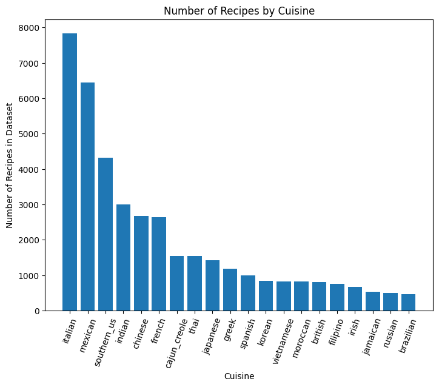
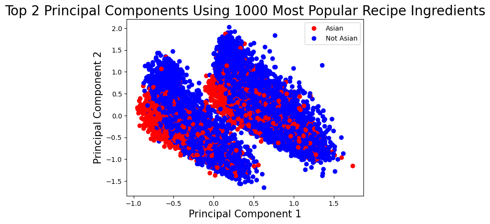
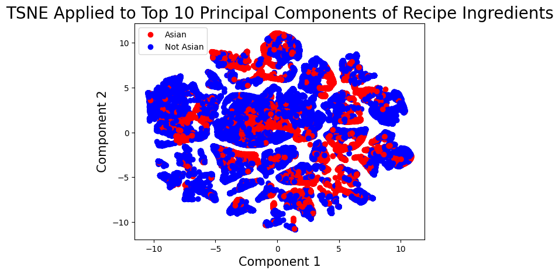
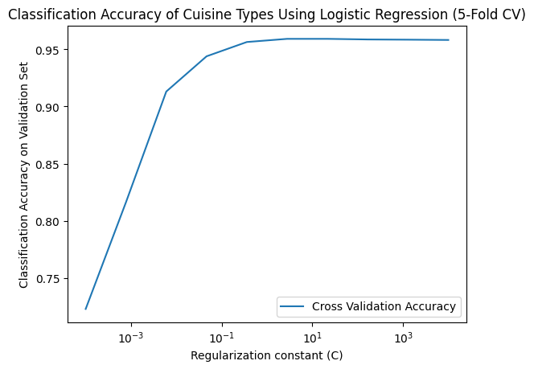
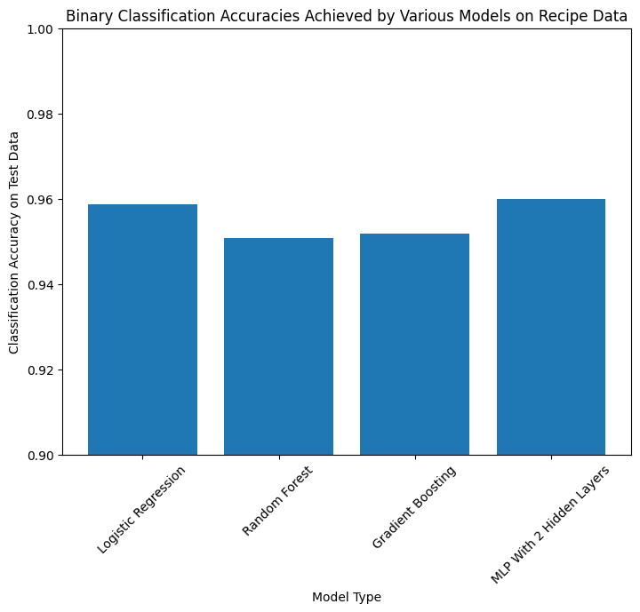
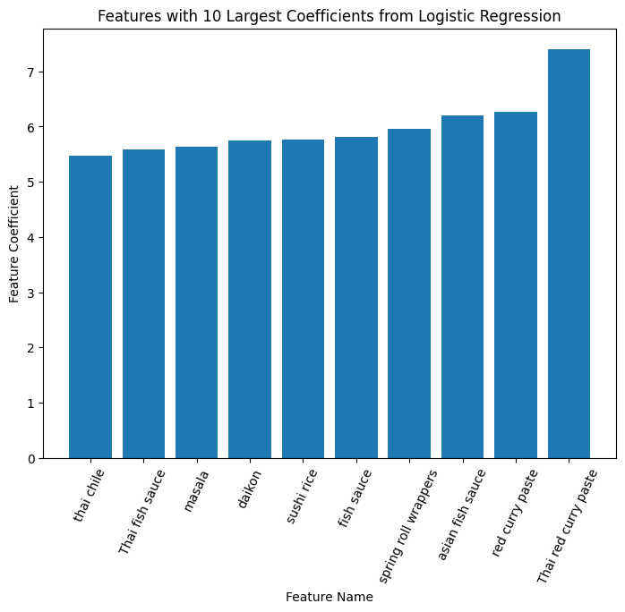
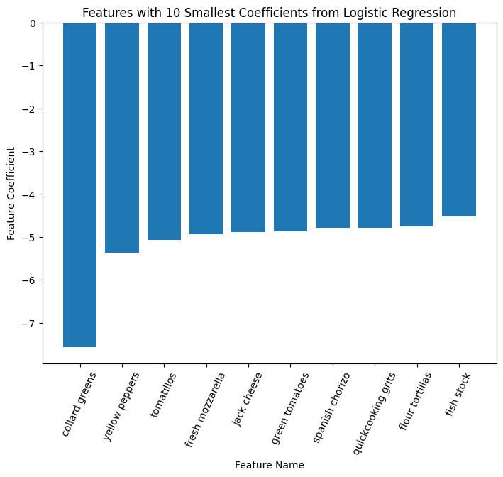
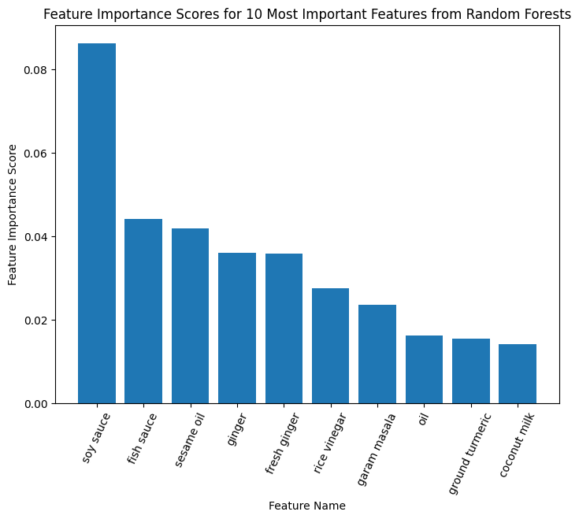
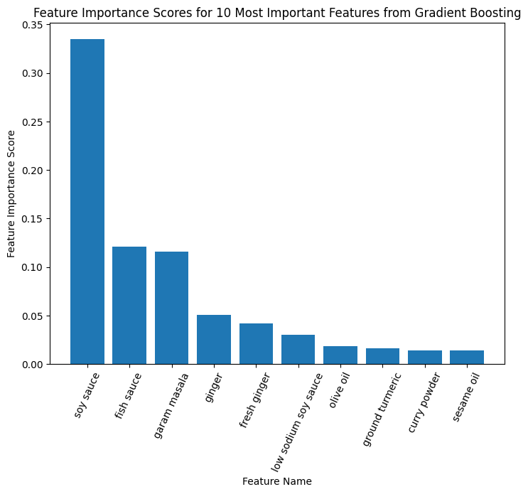

<h1>Data</h1>

This dataset contains data from approximately 40,000 recipes. Each recipe is labeled with a cuisine of origin, and the list of ingredients used in that recipe are included as well. There are 6713 unique ingredients included in the entire dataset, and 20 different cuisines of origin are represented. The exact number of recipes from each cuisine is visualized below.

<h1>Task</h1>

The first task is to predict which recipes are from asian cuisines. For the purpose of this task, the following cuisines will be labeled as asian: 'indian', 'japanese', 'chinese', 'filipino', 'thai', 'korean', and 'vietnamese'. In other words, a classification model will be trained on the data and evaluated on a holdout test set, and the classification accuracy will be reported. The 1000 most frequently occurring ingredients will be used as features for this problem, and the values in the feature matrix will be indicators as to whether an ingredient is present in a given recipe. 

The second task is to identify which ingredients are most important when determining whether a recipe is asian or not. Many cuisines include similar ingredients. For example, onions may be used in Chinese stir frys, French sauces, and Mexican tacos. However, other ingredients are more unique to certain cuisines. For example, one would not expect Mexican masa to appear in a Thai dish. Thus, the goal of this task is to discover the most defining ingredients in asian cuisine. 


<h3>Data Preperation</h3>


```python
import pandas as pd
import numpy as np

from sklearn import decomposition
from sklearn.experimental import enable_iterative_imputer
from sklearn.impute import IterativeImputer
from sklearn.model_selection import train_test_split, cross_val_score, GridSearchCV, KFold
import warnings
warnings.filterwarnings('ignore')

import matplotlib.pyplot as plt
from matplotlib.colors import ListedColormap
```


```python
# The test data has no labels, so a train/test split will be performed on the training data
df= pd.read_json("train.json")

ingredients = df.ingredients.explode().unique()

recipeIngredients = df.ingredients.explode()
countIngredients = recipeIngredients.value_counts().reset_index()
countIngredients = countIngredients.rename(columns = {"index":"Ingredient", "ingredients":"weight"})

print(set(df['cuisine']))
```

    {'italian', 'russian', 'korean', 'moroccan', 'greek', 'filipino', 'japanese', 'mexican', 'jamaican', 'vietnamese', 'brazilian', 'spanish', 'british', 'southern_us', 'cajun_creole', 'irish', 'thai', 'indian', 'french', 'chinese'}


```python
# Check distribution of the cuisines
from collections import Counter
cuisine_counts = Counter(df['cuisine'])
cuisine_counts
```


    Counter({'greek': 1175,
             'southern_us': 4320,
             'filipino': 755,
             'indian': 3003,
             'jamaican': 526,
             'spanish': 989,
             'italian': 7838,
             'mexican': 6438,
             'chinese': 2673,
             'british': 804,
             'thai': 1539,
             'vietnamese': 825,
             'cajun_creole': 1546,
             'brazilian': 467,
             'french': 2646,
             'japanese': 1423,
             'irish': 667,
             'korean': 830,
             'moroccan': 821,
             'russian': 489})


```python
# Vizualize recipe distributions
items = sorted(cuisine_counts.items(), key=lambda x: -x[1])
fig = plt.figure()
ax = fig.add_axes([0,0,1,1])
ax.bar([item[0] for item in items],[item[1] for item in items])

plt.title("Number of Recipes by Cuisine")
plt.xlabel("Cuisine")
plt.ylabel("Number of Recipes in Dataset")
plt.xticks(rotation = 70) # Rotates X-Axis Ticks by 45-degrees
plt.show()
```


    

    


```python
# Convert the data to a binary classification problem: asian cuisine or not
asian_cuisines = ['indian', 'japanese', 'chinese', 'filipino', 'thai', 'korean', 'vietnamese']

df['cuisine'] = df['cuisine'].map(lambda x: 'Asian' if x in asian_cuisines else 'Not Asian')
print(set(df['cuisine']))
cuisines = list(set(df['cuisine']))
```

    {'Asian', 'Not Asian'}


```python
# Slightly imbalanced classes
Counter(df['cuisine'])
```


    Counter({'Not Asian': 28726, 'Asian': 11048})


```python
# Ingredient counts sorted by frequency
countIngredients
```


<div>
<style scoped>
    .dataframe tbody tr th:only-of-type {
        vertical-align: middle;
    }

    .dataframe tbody tr th {
        vertical-align: top;
    }

    .dataframe thead th {
        text-align: right;
    }
</style>
<table border="1" class="dataframe">
  <thead>
    <tr style="text-align: right;">
      <th></th>
      <th>Ingredient</th>
      <th>weight</th>
    </tr>
  </thead>
  <tbody>
    <tr>
      <th>0</th>
      <td>salt</td>
      <td>18049</td>
    </tr>
    <tr>
      <th>1</th>
      <td>olive oil</td>
      <td>7972</td>
    </tr>
    <tr>
      <th>2</th>
      <td>onions</td>
      <td>7972</td>
    </tr>
    <tr>
      <th>3</th>
      <td>water</td>
      <td>7457</td>
    </tr>
    <tr>
      <th>4</th>
      <td>garlic</td>
      <td>7380</td>
    </tr>
    <tr>
      <th>...</th>
      <td>...</td>
      <td>...</td>
    </tr>
    <tr>
      <th>6709</th>
      <td>sauerkraut juice</td>
      <td>1</td>
    </tr>
    <tr>
      <th>6710</th>
      <td>no-calorie sweetener</td>
      <td>1</td>
    </tr>
    <tr>
      <th>6711</th>
      <td>Bob Evans Italian Sausage</td>
      <td>1</td>
    </tr>
    <tr>
      <th>6712</th>
      <td>extra firm silken tofu</td>
      <td>1</td>
    </tr>
    <tr>
      <th>6713</th>
      <td>crushed cheese crackers</td>
      <td>1</td>
    </tr>
  </tbody>
</table>
<p>6714 rows × 2 columns</p>
</div>


```python
# Build a feature matrix using top 1000 most common ingredients
topIngredients = countIngredients[:1000]['Ingredient']
topIngredients
for i in topIngredients: 
    df[i] = df['ingredients'].apply(lambda x: 1 if i in x else 0)
```


```python
df.drop(columns='ingredients', inplace=True)
labels = df['cuisine']
df.drop(columns='cuisine', inplace=True)
df.drop(columns='id', inplace=True)

features = df
features
```


<div>
<style scoped>
    .dataframe tbody tr th:only-of-type {
        vertical-align: middle;
    }

    .dataframe tbody tr th {
        vertical-align: top;
    }

    .dataframe thead th {
        text-align: right;
    }
</style>
<table border="1" class="dataframe">
  <thead>
    <tr style="text-align: right;">
      <th></th>
      <th>salt</th>
      <th>olive oil</th>
      <th>onions</th>
      <th>water</th>
      <th>garlic</th>
      <th>sugar</th>
      <th>garlic cloves</th>
      <th>butter</th>
      <th>ground black pepper</th>
      <th>all-purpose flour</th>
      <th>...</th>
      <th>gari</th>
      <th>fruit</th>
      <th>plain low-fat yogurt</th>
      <th>thai green curry paste</th>
      <th>great northern beans</th>
      <th>seedless cucumber</th>
      <th>salad greens</th>
      <th>organic vegetable broth</th>
      <th>duck</th>
      <th>file powder</th>
    </tr>
  </thead>
  <tbody>
    <tr>
      <th>0</th>
      <td>0</td>
      <td>0</td>
      <td>0</td>
      <td>0</td>
      <td>1</td>
      <td>0</td>
      <td>0</td>
      <td>0</td>
      <td>0</td>
      <td>0</td>
      <td>...</td>
      <td>0</td>
      <td>0</td>
      <td>0</td>
      <td>0</td>
      <td>0</td>
      <td>0</td>
      <td>0</td>
      <td>0</td>
      <td>0</td>
      <td>0</td>
    </tr>
    <tr>
      <th>1</th>
      <td>1</td>
      <td>0</td>
      <td>0</td>
      <td>0</td>
      <td>0</td>
      <td>0</td>
      <td>0</td>
      <td>0</td>
      <td>1</td>
      <td>0</td>
      <td>...</td>
      <td>0</td>
      <td>0</td>
      <td>0</td>
      <td>0</td>
      <td>0</td>
      <td>0</td>
      <td>0</td>
      <td>0</td>
      <td>0</td>
      <td>0</td>
    </tr>
    <tr>
      <th>2</th>
      <td>1</td>
      <td>0</td>
      <td>0</td>
      <td>0</td>
      <td>0</td>
      <td>0</td>
      <td>0</td>
      <td>1</td>
      <td>0</td>
      <td>0</td>
      <td>...</td>
      <td>0</td>
      <td>0</td>
      <td>0</td>
      <td>0</td>
      <td>0</td>
      <td>0</td>
      <td>0</td>
      <td>0</td>
      <td>0</td>
      <td>0</td>
    </tr>
    <tr>
      <th>3</th>
      <td>1</td>
      <td>0</td>
      <td>0</td>
      <td>1</td>
      <td>0</td>
      <td>0</td>
      <td>0</td>
      <td>0</td>
      <td>0</td>
      <td>0</td>
      <td>...</td>
      <td>0</td>
      <td>0</td>
      <td>0</td>
      <td>0</td>
      <td>0</td>
      <td>0</td>
      <td>0</td>
      <td>0</td>
      <td>0</td>
      <td>0</td>
    </tr>
    <tr>
      <th>4</th>
      <td>1</td>
      <td>0</td>
      <td>1</td>
      <td>1</td>
      <td>0</td>
      <td>0</td>
      <td>0</td>
      <td>1</td>
      <td>0</td>
      <td>0</td>
      <td>...</td>
      <td>0</td>
      <td>0</td>
      <td>0</td>
      <td>0</td>
      <td>0</td>
      <td>0</td>
      <td>0</td>
      <td>0</td>
      <td>0</td>
      <td>0</td>
    </tr>
    <tr>
      <th>...</th>
      <td>...</td>
      <td>...</td>
      <td>...</td>
      <td>...</td>
      <td>...</td>
      <td>...</td>
      <td>...</td>
      <td>...</td>
      <td>...</td>
      <td>...</td>
      <td>...</td>
      <td>...</td>
      <td>...</td>
      <td>...</td>
      <td>...</td>
      <td>...</td>
      <td>...</td>
      <td>...</td>
      <td>...</td>
      <td>...</td>
      <td>...</td>
    </tr>
    <tr>
      <th>39769</th>
      <td>1</td>
      <td>0</td>
      <td>0</td>
      <td>0</td>
      <td>0</td>
      <td>0</td>
      <td>0</td>
      <td>1</td>
      <td>0</td>
      <td>1</td>
      <td>...</td>
      <td>0</td>
      <td>0</td>
      <td>0</td>
      <td>0</td>
      <td>0</td>
      <td>0</td>
      <td>0</td>
      <td>0</td>
      <td>0</td>
      <td>0</td>
    </tr>
    <tr>
      <th>39770</th>
      <td>0</td>
      <td>0</td>
      <td>0</td>
      <td>0</td>
      <td>0</td>
      <td>0</td>
      <td>0</td>
      <td>0</td>
      <td>0</td>
      <td>0</td>
      <td>...</td>
      <td>0</td>
      <td>0</td>
      <td>0</td>
      <td>0</td>
      <td>0</td>
      <td>0</td>
      <td>0</td>
      <td>0</td>
      <td>0</td>
      <td>0</td>
    </tr>
    <tr>
      <th>39771</th>
      <td>1</td>
      <td>0</td>
      <td>0</td>
      <td>0</td>
      <td>0</td>
      <td>1</td>
      <td>0</td>
      <td>1</td>
      <td>0</td>
      <td>0</td>
      <td>...</td>
      <td>0</td>
      <td>0</td>
      <td>0</td>
      <td>0</td>
      <td>0</td>
      <td>0</td>
      <td>0</td>
      <td>0</td>
      <td>0</td>
      <td>0</td>
    </tr>
    <tr>
      <th>39772</th>
      <td>0</td>
      <td>0</td>
      <td>0</td>
      <td>0</td>
      <td>0</td>
      <td>1</td>
      <td>0</td>
      <td>0</td>
      <td>0</td>
      <td>0</td>
      <td>...</td>
      <td>0</td>
      <td>0</td>
      <td>0</td>
      <td>0</td>
      <td>0</td>
      <td>0</td>
      <td>0</td>
      <td>0</td>
      <td>0</td>
      <td>0</td>
    </tr>
    <tr>
      <th>39773</th>
      <td>1</td>
      <td>0</td>
      <td>1</td>
      <td>0</td>
      <td>1</td>
      <td>0</td>
      <td>0</td>
      <td>0</td>
      <td>1</td>
      <td>0</td>
      <td>...</td>
      <td>0</td>
      <td>0</td>
      <td>0</td>
      <td>0</td>
      <td>0</td>
      <td>0</td>
      <td>0</td>
      <td>0</td>
      <td>0</td>
      <td>0</td>
    </tr>
  </tbody>
</table>
<p>39774 rows × 1000 columns</p>
</div>


<h3>Unsupervised Techniques</h3>


```python
from sklearn import decomposition
import matplotlib.pyplot as plt
from matplotlib.colors import ListedColormap
from sklearn.manifold import TSNE

pca = decomposition.PCA(n_components=2)
X = pca.fit_transform(features)

NUM_COLORS = len(cuisines)
cm = plt.get_cmap('gist_rainbow')

# Build the plot
vals = {cuisine: i for i, cuisine in enumerate(cuisines)}
c = list(map(lambda x: vals[x], labels))
cmap = ListedColormap(['red', 'blue'])
fig, ax = plt.subplots()
scatter = ax.scatter(X[:,0], X[:,1], c=c, cmap=cmap)

# Add labels
ax.set_xlabel('Principal Component 1', fontsize = 15)
ax.set_ylabel('Principal Component 2', fontsize = 15)
ax.set_title('Top 2 Principal Components Using 1000 Most Popular Recipe Ingredients', fontsize = 20)

plt.legend(handles=scatter.legend_elements()[0], labels=cuisines)

plt.show()
```


    

    


```python
from sklearn import decomposition
import matplotlib.pyplot as plt
from matplotlib.colors import ListedColormap
from sklearn.manifold import TSNE

pca = decomposition.PCA(n_components=10)
pca_result = pca.fit_transform(features)
tsne = TSNE(n_components=2, n_iter=300)
X = tsne.fit_transform(pca_result)

NUM_COLORS = len(cuisines)
cm = plt.get_cmap('gist_rainbow')

# Build the plot
vals = {cuisine: i for i, cuisine in enumerate(cuisines)}
c = list(map(lambda x: vals[x], labels))
cmap = ListedColormap(['red', 'blue'])
fig, ax = plt.subplots()
scatter = ax.scatter(X[:,0], X[:,1], c=c, cmap=cmap)

# Add labels
ax.set_xlabel('Component 1', fontsize = 15)
ax.set_ylabel('Component 2', fontsize = 15)
ax.set_title('TSNE Applied to Top 10 Principal Components of Recipe Ingredients', fontsize = 20)

plt.legend(handles=scatter.legend_elements()[0], labels=cuisines)

plt.show()
```


    

    


<h3>Comparison of at least 3 ML models</h3>

Logistic Regression, Random Forests, Gradient Boosting, andd Multi-Layer Perceptrons will be used to train classifiers and predict whether recipes originate from asian cuisines or not. 

Logistic Regression was selected for a few reasons. First, unlike bayesian classifiers, it makes no assumptions about the distribution of the classes in the space of the features. Second, logistic regression is known to perform well on linear problems, and predicting recipe cuisines based on ingredient lists may be such a problem. Third, logistic regression produces interpretable models, as the coefficients of the features are rough indicators of feature importance.

Random Forests were selected for their strong predictive power. They are able to learn non-linear patterns in the data, and they perform well even without extensive hyperparameter tuning. Additionally, random forests are unlikely to overfit, as they use a subset of observations and features to train ever individual tree, and use "wisdom of the crowd" to make a prediction. Thus, the model is expected to have a relatively low variance. They also produce relatively interpretable feature importance scores, which will assist in task 2. 

Gradient Boosting was selected because it is also known to be a strong learner. Specifically, gradient boosting greedily improves on models in an iterative manner, meaning it is likely to produce a model with a high prediction accuracy as well. Similarly to trees, feature importance scores can be obtained from gradient boosting for interpretability.

Mutli-Layer Perceptrons were selected because there is a significant amount of data (>10000 observations per class), and they have the ability to solve complex nonlinear problems. However, their usefulness is likely limited to task 1 alone, as the weights in a MLP are difficult to interpret.


```python
# Separate into train and test data
X = features
y = labels.map(lambda x: 1 if x == 'Asian' else 0)
X_train, X_test, y_train, y_test = train_test_split(X, y, test_size=0.20, random_state=0)
```


```python
# Logistic Regression
from sklearn.linear_model import LogisticRegressionCV

# Tune hyperparameters using 5-fold CV
fit_logistic_regression = LogisticRegressionCV(cv=5, solver='saga', n_jobs=-1, random_state=0).fit(X_train, y_train)
logistic_regression_score = fit_logistic_regression.score(X_test, y_test)
logistic_regression_score
```


    0.9587680703959773


```python
# Aggregate the cross validation accuracies for each C value tested by the library function
scores = fit_logistic_regression.scores_[1]
k = len(scores)
Cs = fit_logistic_regression.Cs_
cv_accuracy = [0 for i in range(len(Cs))]

for i in range(len(scores)):
    for j in range(len(scores[0])): 
        cv_accuracy[j] += scores[i][j] / k

# Plot lines
plt.plot(Cs, cv_accuracy, label = "Cross Validation Accuracy")
plt.xscale('log')
  
# Set labels
plt.xlabel('Regularization constant (C)')
plt.ylabel('Classification Accuracy on Validation Set')
plt.title('Classification Accuracy of Cuisine Types Using Logistic Regression (5-Fold CV)')
plt.legend()
plt.show()
```


    

    


```python
from sklearn.ensemble import RandomForestClassifier
import time

# Tuning for Random Forests
start = time.time()
n_estimators = range(50, 400, 100)
max_samples = np.arange(0.25, 1.25, 0.25)
best_estimators, best_oob, best_samples = -1, -1, -1
best_fit = None

for i in n_estimators: 
    for k in max_samples: 
        fit = RandomForestClassifier(n_estimators=i, max_samples=k, oob_score=True, n_jobs=-1).fit(X_train, y_train)
        if fit.oob_score_ > best_oob: 
            best_estimators = i
            best_samples = k
            best_oob = fit.oob_score_
            best_fit = fit
            
end = time.time()
print('Best number of estimators in ensemble: ', str(best_estimators))
print('Best proportion of observations in each base estimator: ', str(best_samples))
print('Best oob score: ', str(best_oob))
print('Test Accuracy: ', str(best_fit.score(X_test, y_test)))
print('Time Taken: ', str(end - start))
```

    Best number of estimators in ensemble:  350
    Best proportion of observations in each base estimator:  1.0
    Best oob score:  0.9509412615104184
    Test Accuracy:  0.9508485229415462
    Time Taken:  530.6455409526825


```python
from sklearn.ensemble import GradientBoostingClassifier

# Gradient Boosting
start = time.time()
learning_rates = np.logspace(-1.0, 3.0, num=5, base=10.0)
subsample = np.arange(0.1, 1.1, 0.1)
n_estimators = [int(i) for i in np.logspace(0.0, 2.0, num=3, base=10.0)]
parameters = {'learning_rate':learning_rates , 'n_estimators': n_estimators, 'subsample': subsample}
fit_gdb = GridSearchCV(GradientBoostingClassifier(random_state=0), parameters, n_jobs=-1).fit(X_train, y_train)
end = time.time()

print('Best model: ' + str(fit_gdb.best_estimator_), fit_gdb.best_params_)
print('Best CV Accuracy: ', str(fit_gdb.best_score_))
print('Test Accuracy: ', str(fit_gdb.score(X_test, y_test)))
print('Time Taken: ', str(end - start))
```

    Best model: GradientBoostingClassifier(learning_rate=1.0, random_state=0) {'learning_rate': 1.0, 'n_estimators': 100, 'subsample': 1.0}
    Best CV Accuracy:  0.949495521968467
    Test Accuracy:  0.9518541797611565
    Time Taken:  1370.3905398845673


```python
import tensorflow as tf
from keras import callbacks
from sklearn.metrics import plot_confusion_matrix

# Split the traiining data into training and validation
X_train2, X_val, y_train2, y_val = train_test_split(X_train, y_train, test_size=0.25, random_state=0)
```

    2022-11-30 15:42:26.428647: I tensorflow/core/platform/cpu_feature_guard.cc:193] This TensorFlow binary is optimized with oneAPI Deep Neural Network Library (oneDNN) to use the following CPU instructions in performance-critical operations:  AVX2 FMA
    To enable them in other operations, rebuild TensorFlow with the appropriate compiler flags.


```python
# Utils for plotting confusion matrices

class estimator:
    _estimator_type = ''
    classes_=[]
    def __init__(self, model, classes):
        self.model = model
        self._estimator_type = 'classifier'
        self.classes_ = classes
    def predict(self, X):
        y_prob= self.model.predict(X)
        y_pred = y_prob.argmax(axis=1)
        return y_pred
```


```python
# MLP with 2 hidden layers
def evaluate_layersize(size1, size2, dropout, results):
    earlystopping = callbacks.EarlyStopping(monitor ="val_loss", 
                                        mode ="min", patience = 5, 
                                        restore_best_weights = True)
    
    model = tf.keras.Sequential([
        tf.keras.layers.Flatten(),
        tf.keras.layers.Dense(size1, activation='relu'),
        tf.keras.layers.Dropout(dropout),
        tf.keras.layers.Dense(size2, activation='relu'),
        tf.keras.layers.Dropout(dropout),
        tf.keras.layers.Dense(10, activation='softmax')
    ])
    model.compile(optimizer='adam',
                  loss=tf.keras.losses.SparseCategoricalCrossentropy(from_logits=True),
                  metrics=['accuracy'])
    model.fit(X_train2, y_train2, epochs=25, validation_data=(X_val, y_val), callbacks=[earlystopping])
    
    # Evaluate results on the validation set
    val_loss, val_acc = model.evaluate(X_val, y_val, verbose=2)
    result = '\nValidation accuracy for layer sizes of ' + str(size1) + ' and ' + str(size2) + 'with dropout ' + str(dropout) + ' : ' + str(val_acc)
    results.append(result)
    print(result)
    return val_acc, model
```


```python
# Find the best hidden layer sizes for a MLP using grid search, including dropout layers
base_size = 1000
neuron_counts = [base_size // 100, base_size // 50, base_size // 10, base_size // 2]
dropouts = [0.2, 0.4, 0.5]

best_accuracy_mlp = 0
best_mlp = None
best_params_mlp = []
results_mlp = []

for i in neuron_counts: 
    for j in neuron_counts: 
        for k in dropouts:
            accuracy, model = evaluate_layersize(i, j, k, results_mlp)
            if accuracy > best_accuracy_mlp: 
                best_accuracy_mlp = accuracy
                best_mlp = model
                best_params_mlp = [i, j, k]

# Plot CM
classifier = estimator(best_mlp, ['Not Asian', 'Asian'])
fig, ax = plt.subplots(figsize=(12,12))
plot_confusion_matrix(estimator=classifier, X=X_test, y_true=y_test, cmap='Blues', normalize='true', display_labels=['Not Asian', 'Asian'], ax=ax)
ax.set(xlabel='Predicted', ylabel='Actual', title='Confusion Matrix 2-Layer MLP')
```

    Epoch 1/25
    746/746 [==============================] - 2s 2ms/step - loss: 0.6055 - accuracy: 0.7831 - val_loss: 0.1528 - val_accuracy: 0.9490
    Epoch 2/25
    746/746 [==============================] - 1s 2ms/step - loss: 0.1875 - accuracy: 0.9425 - val_loss: 0.1313 - val_accuracy: 0.9540
    Epoch 3/25
    746/746 [==============================] - 1s 2ms/step - loss: 0.1482 - accuracy: 0.9543 - val_loss: 0.1283 - val_accuracy: 0.9565
    Epoch 4/25
    746/746 [==============================] - 2s 2ms/step - loss: 0.1265 - accuracy: 0.9603 - val_loss: 0.1243 - val_accuracy: 0.9578
    Epoch 5/25
    746/746 [==============================] - 2s 2ms/step - loss: 0.1138 - accuracy: 0.9639 - val_loss: 0.1260 - val_accuracy: 0.9580
    Epoch 6/25
    746/746 [==============================] - 2s 2ms/step - loss: 0.1091 - accuracy: 0.9661 - val_loss: 0.1242 - val_accuracy: 0.9595
    Epoch 7/25
    746/746 [==============================] - 2s 2ms/step - loss: 0.1015 - accuracy: 0.9667 - val_loss: 0.1278 - val_accuracy: 0.9580
    Epoch 8/25
    746/746 [==============================] - 2s 2ms/step - loss: 0.0943 - accuracy: 0.9696 - val_loss: 0.1295 - val_accuracy: 0.9569
    Epoch 9/25
    746/746 [==============================] - 2s 2ms/step - loss: 0.0919 - accuracy: 0.9692 - val_loss: 0.1304 - val_accuracy: 0.9583
    Epoch 10/25
    746/746 [==============================] - 2s 2ms/step - loss: 0.0876 - accuracy: 0.9718 - val_loss: 0.1341 - val_accuracy: 0.9585
    Epoch 11/25
    746/746 [==============================] - 2s 2ms/step - loss: 0.0833 - accuracy: 0.9726 - val_loss: 0.1360 - val_accuracy: 0.9571
    249/249 - 0s - loss: 0.1242 - accuracy: 0.9595 - 238ms/epoch - 954us/step
    
    Validation accuracy for layer sizes of 10 and 10with dropout 0.2 : 0.9595223069190979
    Epoch 1/25
    746/746 [==============================] - 2s 3ms/step - loss: 0.8350 - accuracy: 0.7559 - val_loss: 0.1569 - val_accuracy: 0.9452
    Epoch 2/25
    746/746 [==============================] - 2s 2ms/step - loss: 0.2564 - accuracy: 0.9174 - val_loss: 0.1306 - val_accuracy: 0.9529
    Epoch 3/25
    746/746 [==============================] - 2s 2ms/step - loss: 0.2000 - accuracy: 0.9383 - val_loss: 0.1256 - val_accuracy: 0.9549
    Epoch 4/25
    746/746 [==============================] - 2s 2ms/step - loss: 0.1681 - accuracy: 0.9462 - val_loss: 0.1246 - val_accuracy: 0.9571
    Epoch 5/25
    746/746 [==============================] - 2s 2ms/step - loss: 0.1550 - accuracy: 0.9463 - val_loss: 0.1269 - val_accuracy: 0.9571
    Epoch 6/25
    746/746 [==============================] - 2s 2ms/step - loss: 0.1437 - accuracy: 0.9516 - val_loss: 0.1271 - val_accuracy: 0.9581
    Epoch 7/25
    746/746 [==============================] - 2s 2ms/step - loss: 0.1354 - accuracy: 0.9516 - val_loss: 0.1289 - val_accuracy: 0.9566
    Epoch 8/25
    746/746 [==============================] - 2s 2ms/step - loss: 0.1254 - accuracy: 0.9547 - val_loss: 0.1319 - val_accuracy: 0.9574
    Epoch 9/25
    746/746 [==============================] - 2s 2ms/step - loss: 0.1224 - accuracy: 0.9561 - val_loss: 0.1377 - val_accuracy: 0.9583
    249/249 - 0s - loss: 0.1246 - accuracy: 0.9571 - 212ms/epoch - 853us/step
    
    Validation accuracy for layer sizes of 10 and 10with dropout 0.4 : 0.9571338891983032
    Epoch 1/25
    746/746 [==============================] - 2s 2ms/step - loss: 0.8693 - accuracy: 0.6652 - val_loss: 0.3450 - val_accuracy: 0.8001
    Epoch 2/25
    746/746 [==============================] - 1s 2ms/step - loss: 0.3921 - accuracy: 0.8390 - val_loss: 0.1853 - val_accuracy: 0.9480
    Epoch 3/25
    746/746 [==============================] - 1s 2ms/step - loss: 0.2830 - accuracy: 0.9076 - val_loss: 0.1487 - val_accuracy: 0.9531
    Epoch 4/25
    746/746 [==============================] - 2s 2ms/step - loss: 0.2297 - accuracy: 0.9334 - val_loss: 0.1405 - val_accuracy: 0.9547
    Epoch 5/25
    746/746 [==============================] - 2s 2ms/step - loss: 0.2067 - accuracy: 0.9400 - val_loss: 0.1351 - val_accuracy: 0.9560
    Epoch 6/25
    746/746 [==============================] - 2s 2ms/step - loss: 0.1881 - accuracy: 0.9453 - val_loss: 0.1375 - val_accuracy: 0.9565
    Epoch 7/25
    746/746 [==============================] - 2s 2ms/step - loss: 0.1820 - accuracy: 0.9463 - val_loss: 0.1336 - val_accuracy: 0.9565
    Epoch 8/25
    746/746 [==============================] - 2s 2ms/step - loss: 0.1776 - accuracy: 0.9474 - val_loss: 0.1368 - val_accuracy: 0.9583
    Epoch 9/25
    746/746 [==============================] - 2s 2ms/step - loss: 0.1714 - accuracy: 0.9497 - val_loss: 0.1425 - val_accuracy: 0.9584
    Epoch 10/25
    746/746 [==============================] - 1s 1ms/step - loss: 0.1673 - accuracy: 0.9511 - val_loss: 0.1431 - val_accuracy: 0.9584
    Epoch 11/25
    746/746 [==============================] - 1s 2ms/step - loss: 0.1589 - accuracy: 0.9501 - val_loss: 0.1417 - val_accuracy: 0.9568
    Epoch 12/25
    746/746 [==============================] - 1s 2ms/step - loss: 0.1585 - accuracy: 0.9503 - val_loss: 0.1449 - val_accuracy: 0.9578
    249/249 - 0s - loss: 0.1336 - accuracy: 0.9565 - 244ms/epoch - 980us/step
    
    Validation accuracy for layer sizes of 10 and 10with dropout 0.5 : 0.9565053582191467
    Epoch 1/25
    746/746 [==============================] - 2s 2ms/step - loss: 0.4574 - accuracy: 0.8615 - val_loss: 0.1387 - val_accuracy: 0.9530
    Epoch 2/25
    746/746 [==============================] - 1s 2ms/step - loss: 0.1459 - accuracy: 0.9515 - val_loss: 0.1343 - val_accuracy: 0.9542
    Epoch 3/25
    746/746 [==============================] - 1s 1ms/step - loss: 0.1218 - accuracy: 0.9620 - val_loss: 0.1226 - val_accuracy: 0.9586
    Epoch 4/25
    746/746 [==============================] - 1s 1ms/step - loss: 0.1112 - accuracy: 0.9647 - val_loss: 0.1247 - val_accuracy: 0.9588
    Epoch 5/25
    746/746 [==============================] - 1s 1ms/step - loss: 0.0994 - accuracy: 0.9674 - val_loss: 0.1230 - val_accuracy: 0.9589
    Epoch 6/25
    746/746 [==============================] - 1s 1ms/step - loss: 0.0945 - accuracy: 0.9687 - val_loss: 0.1256 - val_accuracy: 0.9586
    Epoch 7/25
    746/746 [==============================] - 1s 1ms/step - loss: 0.0884 - accuracy: 0.9712 - val_loss: 0.1268 - val_accuracy: 0.9570
    Epoch 8/25
    746/746 [==============================] - 1s 1ms/step - loss: 0.0836 - accuracy: 0.9728 - val_loss: 0.1306 - val_accuracy: 0.9596
    249/249 - 0s - loss: 0.1226 - accuracy: 0.9586 - 210ms/epoch - 842us/step
    
    Validation accuracy for layer sizes of 10 and 20with dropout 0.2 : 0.9586423635482788
    Epoch 1/25
    746/746 [==============================] - 2s 2ms/step - loss: 0.5574 - accuracy: 0.8283 - val_loss: 0.1477 - val_accuracy: 0.9495
    Epoch 2/25
    746/746 [==============================] - 1s 1ms/step - loss: 0.1969 - accuracy: 0.9354 - val_loss: 0.1288 - val_accuracy: 0.9542
    Epoch 3/25
    746/746 [==============================] - 1s 1ms/step - loss: 0.1645 - accuracy: 0.9490 - val_loss: 0.1228 - val_accuracy: 0.9576
    Epoch 4/25
    746/746 [==============================] - 1s 2ms/step - loss: 0.1330 - accuracy: 0.9578 - val_loss: 0.1237 - val_accuracy: 0.9578
    Epoch 5/25
    746/746 [==============================] - 1s 1ms/step - loss: 0.1263 - accuracy: 0.9611 - val_loss: 0.1251 - val_accuracy: 0.9584
    Epoch 6/25
    746/746 [==============================] - 1s 1ms/step - loss: 0.1164 - accuracy: 0.9635 - val_loss: 0.1270 - val_accuracy: 0.9584
    Epoch 7/25
    746/746 [==============================] - 1s 1ms/step - loss: 0.1126 - accuracy: 0.9643 - val_loss: 0.1307 - val_accuracy: 0.9585
    Epoch 8/25
    746/746 [==============================] - 1s 1ms/step - loss: 0.1057 - accuracy: 0.9655 - val_loss: 0.1326 - val_accuracy: 0.9575
    249/249 - 0s - loss: 0.1228 - accuracy: 0.9576 - 211ms/epoch - 846us/step
    
    Validation accuracy for layer sizes of 10 and 20with dropout 0.4 : 0.9576367139816284
    Epoch 1/25
    746/746 [==============================] - 2s 2ms/step - loss: 0.6924 - accuracy: 0.7884 - val_loss: 0.1632 - val_accuracy: 0.9454
    Epoch 2/25
    746/746 [==============================] - 1s 1ms/step - loss: 0.2369 - accuracy: 0.9170 - val_loss: 0.1317 - val_accuracy: 0.9526
    Epoch 3/25
    746/746 [==============================] - 1s 1ms/step - loss: 0.1874 - accuracy: 0.9363 - val_loss: 0.1299 - val_accuracy: 0.9546
    Epoch 4/25
    746/746 [==============================] - 1s 1ms/step - loss: 0.1632 - accuracy: 0.9441 - val_loss: 0.1262 - val_accuracy: 0.9554
    Epoch 5/25
    746/746 [==============================] - 1s 1ms/step - loss: 0.1506 - accuracy: 0.9463 - val_loss: 0.1287 - val_accuracy: 0.9560
    Epoch 6/25
    746/746 [==============================] - 1s 1ms/step - loss: 0.1437 - accuracy: 0.9483 - val_loss: 0.1283 - val_accuracy: 0.9573
    Epoch 7/25
    746/746 [==============================] - 1s 1ms/step - loss: 0.1414 - accuracy: 0.9465 - val_loss: 0.1314 - val_accuracy: 0.9578
    Epoch 8/25
    746/746 [==============================] - 1s 1ms/step - loss: 0.1320 - accuracy: 0.9501 - val_loss: 0.1323 - val_accuracy: 0.9573
    Epoch 9/25
    746/746 [==============================] - 1s 1ms/step - loss: 0.1268 - accuracy: 0.9513 - val_loss: 0.1383 - val_accuracy: 0.9569
    249/249 - 0s - loss: 0.1262 - accuracy: 0.9554 - 210ms/epoch - 843us/step
    
    Validation accuracy for layer sizes of 10 and 20with dropout 0.5 : 0.955374002456665
    Epoch 1/25
    746/746 [==============================] - 2s 2ms/step - loss: 0.3338 - accuracy: 0.9070 - val_loss: 0.1304 - val_accuracy: 0.9542
    Epoch 2/25
    746/746 [==============================] - 1s 1ms/step - loss: 0.1242 - accuracy: 0.9585 - val_loss: 0.1230 - val_accuracy: 0.9564
    Epoch 3/25
    746/746 [==============================] - 1s 1ms/step - loss: 0.1081 - accuracy: 0.9641 - val_loss: 0.1212 - val_accuracy: 0.9583
    Epoch 4/25
    746/746 [==============================] - 1s 2ms/step - loss: 0.1003 - accuracy: 0.9661 - val_loss: 0.1216 - val_accuracy: 0.9584
    Epoch 5/25
    746/746 [==============================] - 2s 3ms/step - loss: 0.0936 - accuracy: 0.9691 - val_loss: 0.1227 - val_accuracy: 0.9588
    Epoch 6/25
    746/746 [==============================] - 2s 2ms/step - loss: 0.0862 - accuracy: 0.9718 - val_loss: 0.1208 - val_accuracy: 0.9591
    Epoch 7/25
    746/746 [==============================] - 2s 2ms/step - loss: 0.0806 - accuracy: 0.9731 - val_loss: 0.1276 - val_accuracy: 0.9552
    Epoch 8/25
    746/746 [==============================] - 2s 2ms/step - loss: 0.0758 - accuracy: 0.9750 - val_loss: 0.1325 - val_accuracy: 0.9584
    Epoch 9/25
    746/746 [==============================] - 2s 2ms/step - loss: 0.0712 - accuracy: 0.9765 - val_loss: 0.1402 - val_accuracy: 0.9570
    Epoch 10/25
    746/746 [==============================] - 2s 2ms/step - loss: 0.0679 - accuracy: 0.9780 - val_loss: 0.1422 - val_accuracy: 0.9551
    Epoch 11/25
    746/746 [==============================] - 2s 2ms/step - loss: 0.0645 - accuracy: 0.9784 - val_loss: 0.1417 - val_accuracy: 0.9571
    249/249 - 0s - loss: 0.1208 - accuracy: 0.9591 - 212ms/epoch - 851us/step
    
    Validation accuracy for layer sizes of 10 and 100with dropout 0.2 : 0.959145188331604
    Epoch 1/25
    746/746 [==============================] - 3s 2ms/step - loss: 0.4269 - accuracy: 0.8512 - val_loss: 0.1413 - val_accuracy: 0.9505
    Epoch 2/25
    746/746 [==============================] - 2s 2ms/step - loss: 0.1582 - accuracy: 0.9437 - val_loss: 0.1248 - val_accuracy: 0.9571
    Epoch 3/25
    746/746 [==============================] - 2s 2ms/step - loss: 0.1301 - accuracy: 0.9562 - val_loss: 0.1193 - val_accuracy: 0.9590
    Epoch 4/25
    746/746 [==============================] - 2s 2ms/step - loss: 0.1177 - accuracy: 0.9585 - val_loss: 0.1237 - val_accuracy: 0.9575
    Epoch 5/25
    746/746 [==============================] - 2s 2ms/step - loss: 0.1074 - accuracy: 0.9622 - val_loss: 0.1210 - val_accuracy: 0.9585
    Epoch 6/25
    746/746 [==============================] - 2s 2ms/step - loss: 0.1043 - accuracy: 0.9621 - val_loss: 0.1200 - val_accuracy: 0.9583
    Epoch 7/25
    746/746 [==============================] - 2s 2ms/step - loss: 0.1019 - accuracy: 0.9626 - val_loss: 0.1207 - val_accuracy: 0.9586
    Epoch 8/25
    746/746 [==============================] - 2s 2ms/step - loss: 0.0941 - accuracy: 0.9656 - val_loss: 0.1224 - val_accuracy: 0.9573
    249/249 - 0s - loss: 0.1193 - accuracy: 0.9590 - 214ms/epoch - 859us/step
    
    Validation accuracy for layer sizes of 10 and 100with dropout 0.4 : 0.9590194821357727
    Epoch 1/25
    746/746 [==============================] - 2s 3ms/step - loss: 0.4564 - accuracy: 0.8343 - val_loss: 0.1478 - val_accuracy: 0.9506
    Epoch 2/25
    746/746 [==============================] - 2s 2ms/step - loss: 0.1757 - accuracy: 0.9405 - val_loss: 0.1265 - val_accuracy: 0.9549
    Epoch 3/25
    746/746 [==============================] - 2s 2ms/step - loss: 0.1462 - accuracy: 0.9504 - val_loss: 0.1214 - val_accuracy: 0.9559
    Epoch 4/25
    746/746 [==============================] - 2s 2ms/step - loss: 0.1345 - accuracy: 0.9549 - val_loss: 0.1210 - val_accuracy: 0.9570
    Epoch 5/25
    746/746 [==============================] - 2s 3ms/step - loss: 0.1244 - accuracy: 0.9576 - val_loss: 0.1195 - val_accuracy: 0.9579
    Epoch 6/25
    746/746 [==============================] - 2s 2ms/step - loss: 0.1195 - accuracy: 0.9600 - val_loss: 0.1197 - val_accuracy: 0.9578
    Epoch 7/25
    746/746 [==============================] - 2s 2ms/step - loss: 0.1142 - accuracy: 0.9619 - val_loss: 0.1202 - val_accuracy: 0.9579
    Epoch 8/25
    746/746 [==============================] - 2s 2ms/step - loss: 0.1115 - accuracy: 0.9621 - val_loss: 0.1222 - val_accuracy: 0.9568
    Epoch 9/25
    746/746 [==============================] - 2s 2ms/step - loss: 0.1106 - accuracy: 0.9614 - val_loss: 0.1221 - val_accuracy: 0.9569
    Epoch 10/25
    746/746 [==============================] - 2s 2ms/step - loss: 0.1072 - accuracy: 0.9633 - val_loss: 0.1228 - val_accuracy: 0.9568
    249/249 - 0s - loss: 0.1195 - accuracy: 0.9579 - 215ms/epoch - 864us/step
    
    Validation accuracy for layer sizes of 10 and 100with dropout 0.5 : 0.957888126373291
    Epoch 1/25
    746/746 [==============================] - 2s 3ms/step - loss: 0.2783 - accuracy: 0.9109 - val_loss: 0.1337 - val_accuracy: 0.9534
    Epoch 2/25
    746/746 [==============================] - 2s 2ms/step - loss: 0.1188 - accuracy: 0.9597 - val_loss: 0.1248 - val_accuracy: 0.9575
    Epoch 3/25
    746/746 [==============================] - 2s 3ms/step - loss: 0.1035 - accuracy: 0.9650 - val_loss: 0.1311 - val_accuracy: 0.9561
    Epoch 4/25
    746/746 [==============================] - 2s 3ms/step - loss: 0.0925 - accuracy: 0.9683 - val_loss: 0.1222 - val_accuracy: 0.9586
    Epoch 5/25
    746/746 [==============================] - 2s 3ms/step - loss: 0.0867 - accuracy: 0.9711 - val_loss: 0.1265 - val_accuracy: 0.9545
    Epoch 6/25
    746/746 [==============================] - 2s 2ms/step - loss: 0.0800 - accuracy: 0.9739 - val_loss: 0.1313 - val_accuracy: 0.9573
    Epoch 7/25
    746/746 [==============================] - 2s 2ms/step - loss: 0.0748 - accuracy: 0.9750 - val_loss: 0.1354 - val_accuracy: 0.9570
    Epoch 8/25
    746/746 [==============================] - 2s 3ms/step - loss: 0.0705 - accuracy: 0.9771 - val_loss: 0.1326 - val_accuracy: 0.9576
    Epoch 9/25
    746/746 [==============================] - 2s 3ms/step - loss: 0.0680 - accuracy: 0.9787 - val_loss: 0.1437 - val_accuracy: 0.9568
    249/249 - 0s - loss: 0.1222 - accuracy: 0.9586 - 222ms/epoch - 892us/step
    
    Validation accuracy for layer sizes of 10 and 500with dropout 0.2 : 0.9586423635482788
    Epoch 1/25
    746/746 [==============================] - 3s 3ms/step - loss: 0.3128 - accuracy: 0.8964 - val_loss: 0.1333 - val_accuracy: 0.9536
    Epoch 2/25
    746/746 [==============================] - 2s 3ms/step - loss: 0.1363 - accuracy: 0.9547 - val_loss: 0.1235 - val_accuracy: 0.9559
    Epoch 3/25
    746/746 [==============================] - 2s 3ms/step - loss: 0.1168 - accuracy: 0.9605 - val_loss: 0.1195 - val_accuracy: 0.9569
    Epoch 4/25
    746/746 [==============================] - 2s 2ms/step - loss: 0.1098 - accuracy: 0.9627 - val_loss: 0.1200 - val_accuracy: 0.9571
    Epoch 5/25
    746/746 [==============================] - 2s 2ms/step - loss: 0.1029 - accuracy: 0.9653 - val_loss: 0.1211 - val_accuracy: 0.9574
    Epoch 6/25
    746/746 [==============================] - 2s 2ms/step - loss: 0.0985 - accuracy: 0.9664 - val_loss: 0.1199 - val_accuracy: 0.9585
    Epoch 7/25
    746/746 [==============================] - 2s 2ms/step - loss: 0.0926 - accuracy: 0.9693 - val_loss: 0.1272 - val_accuracy: 0.9565
    Epoch 8/25
    746/746 [==============================] - 2s 2ms/step - loss: 0.0890 - accuracy: 0.9700 - val_loss: 0.1238 - val_accuracy: 0.9581
    249/249 - 0s - loss: 0.1195 - accuracy: 0.9569 - 217ms/epoch - 872us/step
    
    Validation accuracy for layer sizes of 10 and 500with dropout 0.4 : 0.9568824768066406
    Epoch 1/25
    746/746 [==============================] - 2s 3ms/step - loss: 0.3525 - accuracy: 0.8778 - val_loss: 0.1361 - val_accuracy: 0.9525
    Epoch 2/25
    746/746 [==============================] - 2s 2ms/step - loss: 0.1546 - accuracy: 0.9480 - val_loss: 0.1247 - val_accuracy: 0.9542
    Epoch 3/25
    746/746 [==============================] - 2s 2ms/step - loss: 0.1370 - accuracy: 0.9543 - val_loss: 0.1217 - val_accuracy: 0.9580
    Epoch 4/25
    746/746 [==============================] - 2s 2ms/step - loss: 0.1224 - accuracy: 0.9583 - val_loss: 0.1209 - val_accuracy: 0.9581
    Epoch 5/25
    746/746 [==============================] - 2s 3ms/step - loss: 0.1168 - accuracy: 0.9596 - val_loss: 0.1210 - val_accuracy: 0.9588
    Epoch 6/25
    746/746 [==============================] - 2s 3ms/step - loss: 0.1175 - accuracy: 0.9594 - val_loss: 0.1205 - val_accuracy: 0.9583
    Epoch 7/25
    746/746 [==============================] - 2s 3ms/step - loss: 0.1097 - accuracy: 0.9614 - val_loss: 0.1215 - val_accuracy: 0.9590
    Epoch 8/25
    746/746 [==============================] - 2s 3ms/step - loss: 0.1104 - accuracy: 0.9615 - val_loss: 0.1222 - val_accuracy: 0.9588
    Epoch 9/25
    746/746 [==============================] - 2s 3ms/step - loss: 0.1062 - accuracy: 0.9627 - val_loss: 0.1235 - val_accuracy: 0.9579
    Epoch 10/25
    746/746 [==============================] - 2s 3ms/step - loss: 0.1065 - accuracy: 0.9621 - val_loss: 0.1267 - val_accuracy: 0.9574
    Epoch 11/25
    746/746 [==============================] - 2s 3ms/step - loss: 0.1036 - accuracy: 0.9623 - val_loss: 0.1251 - val_accuracy: 0.9586
    249/249 - 0s - loss: 0.1205 - accuracy: 0.9583 - 221ms/epoch - 886us/step
    
    Validation accuracy for layer sizes of 10 and 500with dropout 0.5 : 0.9582652449607849
    Epoch 1/25
    746/746 [==============================] - 2s 3ms/step - loss: 0.5170 - accuracy: 0.8447 - val_loss: 0.1401 - val_accuracy: 0.9531
    Epoch 2/25
    746/746 [==============================] - 2s 2ms/step - loss: 0.1466 - accuracy: 0.9543 - val_loss: 0.1251 - val_accuracy: 0.9566
    Epoch 3/25
    746/746 [==============================] - 2s 2ms/step - loss: 0.1208 - accuracy: 0.9615 - val_loss: 0.1223 - val_accuracy: 0.9576
    Epoch 4/25
    746/746 [==============================] - 2s 2ms/step - loss: 0.1090 - accuracy: 0.9664 - val_loss: 0.1218 - val_accuracy: 0.9579
    Epoch 5/25
    746/746 [==============================] - 2s 3ms/step - loss: 0.1031 - accuracy: 0.9670 - val_loss: 0.1225 - val_accuracy: 0.9591
    Epoch 6/25
    746/746 [==============================] - 2s 2ms/step - loss: 0.0942 - accuracy: 0.9692 - val_loss: 0.1278 - val_accuracy: 0.9588
    Epoch 7/25
    746/746 [==============================] - 2s 2ms/step - loss: 0.0840 - accuracy: 0.9726 - val_loss: 0.1323 - val_accuracy: 0.9590
    Epoch 8/25
    746/746 [==============================] - 2s 2ms/step - loss: 0.0804 - accuracy: 0.9746 - val_loss: 0.1352 - val_accuracy: 0.9604
    Epoch 9/25
    746/746 [==============================] - 2s 2ms/step - loss: 0.0726 - accuracy: 0.9769 - val_loss: 0.1457 - val_accuracy: 0.9560
    249/249 - 0s - loss: 0.1218 - accuracy: 0.9579 - 225ms/epoch - 903us/step
    
    Validation accuracy for layer sizes of 20 and 10with dropout 0.2 : 0.957888126373291
    Epoch 1/25
    746/746 [==============================] - 2s 3ms/step - loss: 0.6186 - accuracy: 0.7984 - val_loss: 0.1513 - val_accuracy: 0.9492
    Epoch 2/25
    746/746 [==============================] - 2s 2ms/step - loss: 0.2207 - accuracy: 0.9343 - val_loss: 0.1314 - val_accuracy: 0.9541
    Epoch 3/25
    746/746 [==============================] - 2s 2ms/step - loss: 0.1794 - accuracy: 0.9460 - val_loss: 0.1268 - val_accuracy: 0.9555
    Epoch 4/25
    746/746 [==============================] - 2s 3ms/step - loss: 0.1592 - accuracy: 0.9524 - val_loss: 0.1234 - val_accuracy: 0.9584
    Epoch 5/25
    746/746 [==============================] - 2s 2ms/step - loss: 0.1425 - accuracy: 0.9573 - val_loss: 0.1238 - val_accuracy: 0.9571
    Epoch 6/25
    746/746 [==============================] - 2s 2ms/step - loss: 0.1323 - accuracy: 0.9598 - val_loss: 0.1262 - val_accuracy: 0.9588
    Epoch 7/25
    746/746 [==============================] - 2s 2ms/step - loss: 0.1212 - accuracy: 0.9612 - val_loss: 0.1283 - val_accuracy: 0.9593
    Epoch 8/25
    746/746 [==============================] - 2s 2ms/step - loss: 0.1154 - accuracy: 0.9645 - val_loss: 0.1325 - val_accuracy: 0.9586
    Epoch 9/25
    746/746 [==============================] - 2s 2ms/step - loss: 0.1073 - accuracy: 0.9683 - val_loss: 0.1344 - val_accuracy: 0.9594
    249/249 - 0s - loss: 0.1234 - accuracy: 0.9584 - 228ms/epoch - 914us/step
    
    Validation accuracy for layer sizes of 20 and 10with dropout 0.4 : 0.9583909511566162
    Epoch 1/25
    746/746 [==============================] - 2s 3ms/step - loss: 0.7345 - accuracy: 0.7506 - val_loss: 0.1624 - val_accuracy: 0.9432
    Epoch 2/25
    746/746 [==============================] - 2s 2ms/step - loss: 0.2557 - accuracy: 0.9235 - val_loss: 0.1353 - val_accuracy: 0.9525
    Epoch 3/25
    746/746 [==============================] - 2s 2ms/step - loss: 0.2042 - accuracy: 0.9381 - val_loss: 0.1256 - val_accuracy: 0.9564
    Epoch 4/25
    746/746 [==============================] - 2s 2ms/step - loss: 0.1782 - accuracy: 0.9438 - val_loss: 0.1209 - val_accuracy: 0.9580
    Epoch 5/25
    746/746 [==============================] - 2s 2ms/step - loss: 0.1652 - accuracy: 0.9467 - val_loss: 0.1242 - val_accuracy: 0.9574
    Epoch 6/25
    746/746 [==============================] - 2s 2ms/step - loss: 0.1536 - accuracy: 0.9492 - val_loss: 0.1219 - val_accuracy: 0.9571
    Epoch 7/25
    746/746 [==============================] - 2s 2ms/step - loss: 0.1434 - accuracy: 0.9511 - val_loss: 0.1226 - val_accuracy: 0.9573
    Epoch 8/25
    746/746 [==============================] - 2s 2ms/step - loss: 0.1408 - accuracy: 0.9493 - val_loss: 0.1291 - val_accuracy: 0.9574
    Epoch 9/25
    746/746 [==============================] - 2s 3ms/step - loss: 0.1288 - accuracy: 0.9524 - val_loss: 0.1349 - val_accuracy: 0.9571
    249/249 - 0s - loss: 0.1209 - accuracy: 0.9580 - 229ms/epoch - 921us/step
    
    Validation accuracy for layer sizes of 20 and 10with dropout 0.5 : 0.9580138325691223
    Epoch 1/25
    746/746 [==============================] - 2s 3ms/step - loss: 0.3764 - accuracy: 0.8791 - val_loss: 0.1338 - val_accuracy: 0.9550
    Epoch 2/25
    746/746 [==============================] - 2s 2ms/step - loss: 0.1326 - accuracy: 0.9565 - val_loss: 0.1235 - val_accuracy: 0.9583
    Epoch 3/25
    746/746 [==============================] - 2s 2ms/step - loss: 0.1106 - accuracy: 0.9642 - val_loss: 0.1249 - val_accuracy: 0.9581
    Epoch 4/25
    746/746 [==============================] - 2s 2ms/step - loss: 0.1033 - accuracy: 0.9661 - val_loss: 0.1224 - val_accuracy: 0.9584
    Epoch 5/25
    746/746 [==============================] - 2s 2ms/step - loss: 0.0936 - accuracy: 0.9683 - val_loss: 0.1249 - val_accuracy: 0.9586
    Epoch 6/25
    746/746 [==============================] - 2s 2ms/step - loss: 0.0857 - accuracy: 0.9715 - val_loss: 0.1277 - val_accuracy: 0.9571
    Epoch 7/25
    746/746 [==============================] - 2s 2ms/step - loss: 0.0803 - accuracy: 0.9728 - val_loss: 0.1335 - val_accuracy: 0.9591
    Epoch 8/25
    746/746 [==============================] - 2s 2ms/step - loss: 0.0753 - accuracy: 0.9757 - val_loss: 0.1323 - val_accuracy: 0.9575
    Epoch 9/25
    746/746 [==============================] - 2s 2ms/step - loss: 0.0707 - accuracy: 0.9768 - val_loss: 0.1405 - val_accuracy: 0.9561
    249/249 - 0s - loss: 0.1224 - accuracy: 0.9584 - 225ms/epoch - 903us/step
    
    Validation accuracy for layer sizes of 20 and 20with dropout 0.2 : 0.9583909511566162
    Epoch 1/25
    746/746 [==============================] - 2s 3ms/step - loss: 0.4878 - accuracy: 0.8452 - val_loss: 0.1475 - val_accuracy: 0.9483
    Epoch 2/25
    746/746 [==============================] - 2s 2ms/step - loss: 0.1670 - accuracy: 0.9488 - val_loss: 0.1285 - val_accuracy: 0.9559
    Epoch 3/25
    746/746 [==============================] - 2s 2ms/step - loss: 0.1367 - accuracy: 0.9561 - val_loss: 0.1283 - val_accuracy: 0.9563
    Epoch 4/25
    746/746 [==============================] - 2s 3ms/step - loss: 0.1227 - accuracy: 0.9630 - val_loss: 0.1227 - val_accuracy: 0.9581
    Epoch 5/25
    746/746 [==============================] - 2s 2ms/step - loss: 0.1123 - accuracy: 0.9646 - val_loss: 0.1251 - val_accuracy: 0.9580
    Epoch 6/25
    746/746 [==============================] - 2s 2ms/step - loss: 0.1060 - accuracy: 0.9669 - val_loss: 0.1369 - val_accuracy: 0.9579
    Epoch 7/25
    746/746 [==============================] - 2s 2ms/step - loss: 0.1008 - accuracy: 0.9690 - val_loss: 0.1336 - val_accuracy: 0.9584
    Epoch 8/25
    746/746 [==============================] - 2s 2ms/step - loss: 0.0916 - accuracy: 0.9720 - val_loss: 0.1294 - val_accuracy: 0.9566
    Epoch 9/25
    746/746 [==============================] - 2s 2ms/step - loss: 0.0908 - accuracy: 0.9707 - val_loss: 0.1317 - val_accuracy: 0.9584
    249/249 - 0s - loss: 0.1227 - accuracy: 0.9581 - 226ms/epoch - 909us/step
    
    Validation accuracy for layer sizes of 20 and 20with dropout 0.4 : 0.9581395387649536
    Epoch 1/25
    746/746 [==============================] - 2s 3ms/step - loss: 0.6627 - accuracy: 0.7950 - val_loss: 0.1501 - val_accuracy: 0.9468
    Epoch 2/25
    746/746 [==============================] - 2s 3ms/step - loss: 0.1947 - accuracy: 0.9399 - val_loss: 0.1308 - val_accuracy: 0.9549
    Epoch 3/25
    746/746 [==============================] - 2s 2ms/step - loss: 0.1574 - accuracy: 0.9507 - val_loss: 0.1308 - val_accuracy: 0.9558
    Epoch 4/25
    746/746 [==============================] - 2s 2ms/step - loss: 0.1417 - accuracy: 0.9545 - val_loss: 0.1255 - val_accuracy: 0.9583
    Epoch 5/25
    746/746 [==============================] - 2s 2ms/step - loss: 0.1271 - accuracy: 0.9601 - val_loss: 0.1297 - val_accuracy: 0.9586
    Epoch 6/25
    746/746 [==============================] - 2s 2ms/step - loss: 0.1201 - accuracy: 0.9627 - val_loss: 0.1280 - val_accuracy: 0.9580
    Epoch 7/25
    746/746 [==============================] - 2s 3ms/step - loss: 0.1137 - accuracy: 0.9642 - val_loss: 0.1301 - val_accuracy: 0.9576
    Epoch 8/25
    746/746 [==============================] - 2s 2ms/step - loss: 0.1070 - accuracy: 0.9645 - val_loss: 0.1305 - val_accuracy: 0.9583
    Epoch 9/25
    746/746 [==============================] - 2s 2ms/step - loss: 0.1055 - accuracy: 0.9656 - val_loss: 0.1328 - val_accuracy: 0.9578
    249/249 - 0s - loss: 0.1255 - accuracy: 0.9583 - 232ms/epoch - 930us/step
    
    Validation accuracy for layer sizes of 20 and 20with dropout 0.5 : 0.9582652449607849
    Epoch 1/25
    746/746 [==============================] - 2s 3ms/step - loss: 0.2873 - accuracy: 0.9142 - val_loss: 0.1276 - val_accuracy: 0.9555
    Epoch 2/25
    746/746 [==============================] - 2s 2ms/step - loss: 0.1191 - accuracy: 0.9585 - val_loss: 0.1239 - val_accuracy: 0.9573
    Epoch 3/25
    746/746 [==============================] - 2s 3ms/step - loss: 0.1026 - accuracy: 0.9653 - val_loss: 0.1201 - val_accuracy: 0.9594
    Epoch 4/25
    746/746 [==============================] - 2s 3ms/step - loss: 0.0945 - accuracy: 0.9679 - val_loss: 0.1212 - val_accuracy: 0.9574
    Epoch 5/25
    746/746 [==============================] - 2s 2ms/step - loss: 0.0854 - accuracy: 0.9714 - val_loss: 0.1308 - val_accuracy: 0.9580
    Epoch 6/25
    746/746 [==============================] - 2s 2ms/step - loss: 0.0780 - accuracy: 0.9725 - val_loss: 0.1279 - val_accuracy: 0.9565
    Epoch 7/25
    746/746 [==============================] - 2s 2ms/step - loss: 0.0708 - accuracy: 0.9757 - val_loss: 0.1367 - val_accuracy: 0.9578
    Epoch 8/25
    746/746 [==============================] - 2s 2ms/step - loss: 0.0632 - accuracy: 0.9786 - val_loss: 0.1470 - val_accuracy: 0.9565
    249/249 - 0s - loss: 0.1201 - accuracy: 0.9594 - 239ms/epoch - 959us/step
    
    Validation accuracy for layer sizes of 20 and 100with dropout 0.2 : 0.9593966007232666
    Epoch 1/25
    746/746 [==============================] - 3s 3ms/step - loss: 0.3472 - accuracy: 0.8939 - val_loss: 0.1360 - val_accuracy: 0.9531
    Epoch 2/25
    746/746 [==============================] - 2s 2ms/step - loss: 0.1319 - accuracy: 0.9569 - val_loss: 0.1337 - val_accuracy: 0.9545
    Epoch 3/25
    746/746 [==============================] - 2s 2ms/step - loss: 0.1110 - accuracy: 0.9630 - val_loss: 0.1234 - val_accuracy: 0.9570
    Epoch 4/25
    746/746 [==============================] - 2s 3ms/step - loss: 0.1031 - accuracy: 0.9652 - val_loss: 0.1186 - val_accuracy: 0.9590
    Epoch 5/25
    746/746 [==============================] - 2s 3ms/step - loss: 0.0930 - accuracy: 0.9687 - val_loss: 0.1221 - val_accuracy: 0.9591
    Epoch 6/25
    746/746 [==============================] - 2s 2ms/step - loss: 0.0886 - accuracy: 0.9705 - val_loss: 0.1216 - val_accuracy: 0.9586
    Epoch 7/25
    746/746 [==============================] - 2s 2ms/step - loss: 0.0834 - accuracy: 0.9726 - val_loss: 0.1281 - val_accuracy: 0.9583
    Epoch 8/25
    746/746 [==============================] - 2s 2ms/step - loss: 0.0774 - accuracy: 0.9747 - val_loss: 0.1290 - val_accuracy: 0.9594
    Epoch 9/25
    746/746 [==============================] - 2s 2ms/step - loss: 0.0720 - accuracy: 0.9755 - val_loss: 0.1350 - val_accuracy: 0.9574
    249/249 - 0s - loss: 0.1186 - accuracy: 0.9590 - 248ms/epoch - 995us/step
    
    Validation accuracy for layer sizes of 20 and 100with dropout 0.4 : 0.9590194821357727
    Epoch 1/25
    746/746 [==============================] - 2s 3ms/step - loss: 0.3695 - accuracy: 0.8827 - val_loss: 0.1409 - val_accuracy: 0.9510
    Epoch 2/25
    746/746 [==============================] - 2s 3ms/step - loss: 0.1450 - accuracy: 0.9527 - val_loss: 0.1236 - val_accuracy: 0.9565
    Epoch 3/25
    746/746 [==============================] - 2s 2ms/step - loss: 0.1212 - accuracy: 0.9604 - val_loss: 0.1267 - val_accuracy: 0.9558
    Epoch 4/25
    746/746 [==============================] - 2s 3ms/step - loss: 0.1106 - accuracy: 0.9649 - val_loss: 0.1253 - val_accuracy: 0.9581
    Epoch 5/25
    746/746 [==============================] - 2s 3ms/step - loss: 0.1018 - accuracy: 0.9657 - val_loss: 0.1268 - val_accuracy: 0.9584
    Epoch 6/25
    746/746 [==============================] - 2s 2ms/step - loss: 0.0970 - accuracy: 0.9677 - val_loss: 0.1247 - val_accuracy: 0.9588
    Epoch 7/25
    746/746 [==============================] - 2s 2ms/step - loss: 0.0911 - accuracy: 0.9706 - val_loss: 0.1278 - val_accuracy: 0.9575
    249/249 - 0s - loss: 0.1236 - accuracy: 0.9565 - 239ms/epoch - 959us/step
    
    Validation accuracy for layer sizes of 20 and 100with dropout 0.5 : 0.9565053582191467
    Epoch 1/25
    746/746 [==============================] - 2s 3ms/step - loss: 0.2476 - accuracy: 0.9209 - val_loss: 0.1319 - val_accuracy: 0.9535
    Epoch 2/25
    746/746 [==============================] - 2s 3ms/step - loss: 0.1144 - accuracy: 0.9606 - val_loss: 0.1248 - val_accuracy: 0.9563
    Epoch 3/25
    746/746 [==============================] - 2s 3ms/step - loss: 0.1003 - accuracy: 0.9648 - val_loss: 0.1200 - val_accuracy: 0.9575
    Epoch 4/25
    746/746 [==============================] - 2s 2ms/step - loss: 0.0888 - accuracy: 0.9690 - val_loss: 0.1233 - val_accuracy: 0.9583
    Epoch 5/25
    746/746 [==============================] - 2s 3ms/step - loss: 0.0783 - accuracy: 0.9741 - val_loss: 0.1272 - val_accuracy: 0.9580
    Epoch 6/25
    746/746 [==============================] - 2s 3ms/step - loss: 0.0705 - accuracy: 0.9760 - val_loss: 0.1297 - val_accuracy: 0.9560
    Epoch 7/25
    746/746 [==============================] - 2s 3ms/step - loss: 0.0614 - accuracy: 0.9796 - val_loss: 0.1377 - val_accuracy: 0.9578
    Epoch 8/25
    746/746 [==============================] - 2s 3ms/step - loss: 0.0561 - accuracy: 0.9811 - val_loss: 0.1537 - val_accuracy: 0.9575
    249/249 - 0s - loss: 0.1200 - accuracy: 0.9575 - 234ms/epoch - 938us/step
    
    Validation accuracy for layer sizes of 20 and 500with dropout 0.2 : 0.9575110077857971
    Epoch 1/25
    746/746 [==============================] - 2s 3ms/step - loss: 0.2753 - accuracy: 0.9117 - val_loss: 0.1342 - val_accuracy: 0.9554
    Epoch 2/25
    746/746 [==============================] - 2s 3ms/step - loss: 0.1230 - accuracy: 0.9576 - val_loss: 0.1248 - val_accuracy: 0.9560
    Epoch 3/25
    746/746 [==============================] - 2s 3ms/step - loss: 0.1076 - accuracy: 0.9633 - val_loss: 0.1229 - val_accuracy: 0.9575
    Epoch 4/25
    746/746 [==============================] - 2s 3ms/step - loss: 0.0965 - accuracy: 0.9661 - val_loss: 0.1207 - val_accuracy: 0.9591
    Epoch 5/25
    746/746 [==============================] - 2s 3ms/step - loss: 0.0892 - accuracy: 0.9698 - val_loss: 0.1222 - val_accuracy: 0.9576
    Epoch 6/25
    746/746 [==============================] - 2s 3ms/step - loss: 0.0825 - accuracy: 0.9710 - val_loss: 0.1240 - val_accuracy: 0.9590
    Epoch 7/25
    746/746 [==============================] - 2s 3ms/step - loss: 0.0766 - accuracy: 0.9742 - val_loss: 0.1286 - val_accuracy: 0.9581
    Epoch 8/25
    746/746 [==============================] - 2s 3ms/step - loss: 0.0718 - accuracy: 0.9749 - val_loss: 0.1338 - val_accuracy: 0.9578
    Epoch 9/25
    746/746 [==============================] - 2s 3ms/step - loss: 0.0641 - accuracy: 0.9774 - val_loss: 0.1445 - val_accuracy: 0.9574
    249/249 - 0s - loss: 0.1207 - accuracy: 0.9591 - 238ms/epoch - 957us/step
    
    Validation accuracy for layer sizes of 20 and 500with dropout 0.4 : 0.959145188331604
    Epoch 1/25
    746/746 [==============================] - 3s 3ms/step - loss: 0.3016 - accuracy: 0.9022 - val_loss: 0.1309 - val_accuracy: 0.9532
    Epoch 2/25
    746/746 [==============================] - 2s 3ms/step - loss: 0.1347 - accuracy: 0.9563 - val_loss: 0.1202 - val_accuracy: 0.9576
    Epoch 3/25
    746/746 [==============================] - 2s 3ms/step - loss: 0.1153 - accuracy: 0.9605 - val_loss: 0.1214 - val_accuracy: 0.9574
    Epoch 4/25
    746/746 [==============================] - 2s 3ms/step - loss: 0.1029 - accuracy: 0.9645 - val_loss: 0.1229 - val_accuracy: 0.9581
    Epoch 5/25
    746/746 [==============================] - 2s 3ms/step - loss: 0.0956 - accuracy: 0.9671 - val_loss: 0.1208 - val_accuracy: 0.9571
    Epoch 6/25
    746/746 [==============================] - 2s 3ms/step - loss: 0.0944 - accuracy: 0.9686 - val_loss: 0.1221 - val_accuracy: 0.9578
    Epoch 7/25
    746/746 [==============================] - 2s 3ms/step - loss: 0.0881 - accuracy: 0.9709 - val_loss: 0.1311 - val_accuracy: 0.9580
    249/249 - 0s - loss: 0.1202 - accuracy: 0.9576 - 252ms/epoch - 1ms/step
    
    Validation accuracy for layer sizes of 20 and 500with dropout 0.5 : 0.9576367139816284
    Epoch 1/25
    746/746 [==============================] - 3s 3ms/step - loss: 0.3362 - accuracy: 0.9067 - val_loss: 0.1282 - val_accuracy: 0.9559
    Epoch 2/25
    746/746 [==============================] - 2s 3ms/step - loss: 0.1315 - accuracy: 0.9594 - val_loss: 0.1215 - val_accuracy: 0.9585
    Epoch 3/25
    746/746 [==============================] - 2s 3ms/step - loss: 0.1089 - accuracy: 0.9664 - val_loss: 0.1204 - val_accuracy: 0.9581
    Epoch 4/25
    746/746 [==============================] - 2s 3ms/step - loss: 0.1018 - accuracy: 0.9669 - val_loss: 0.1213 - val_accuracy: 0.9594
    Epoch 5/25
    746/746 [==============================] - 2s 3ms/step - loss: 0.0873 - accuracy: 0.9715 - val_loss: 0.1326 - val_accuracy: 0.9590
    Epoch 6/25
    746/746 [==============================] - 2s 3ms/step - loss: 0.0745 - accuracy: 0.9755 - val_loss: 0.1326 - val_accuracy: 0.9581
    Epoch 7/25
    746/746 [==============================] - 2s 2ms/step - loss: 0.0663 - accuracy: 0.9785 - val_loss: 0.1404 - val_accuracy: 0.9603
    Epoch 8/25
    746/746 [==============================] - 2s 2ms/step - loss: 0.0554 - accuracy: 0.9819 - val_loss: 0.1480 - val_accuracy: 0.9591
    249/249 - 0s - loss: 0.1204 - accuracy: 0.9581 - 245ms/epoch - 983us/step
    
    Validation accuracy for layer sizes of 100 and 10with dropout 0.2 : 0.9581395387649536
    Epoch 1/25
    746/746 [==============================] - 2s 2ms/step - loss: 0.5272 - accuracy: 0.8228 - val_loss: 0.1445 - val_accuracy: 0.9503
    Epoch 2/25
    746/746 [==============================] - 2s 3ms/step - loss: 0.2200 - accuracy: 0.9296 - val_loss: 0.1263 - val_accuracy: 0.9561
    Epoch 3/25
    746/746 [==============================] - 2s 3ms/step - loss: 0.1896 - accuracy: 0.9387 - val_loss: 0.1220 - val_accuracy: 0.9570
    Epoch 4/25
    746/746 [==============================] - 2s 3ms/step - loss: 0.1651 - accuracy: 0.9413 - val_loss: 0.1246 - val_accuracy: 0.9583
    Epoch 5/25
    746/746 [==============================] - 2s 3ms/step - loss: 0.1497 - accuracy: 0.9376 - val_loss: 0.1244 - val_accuracy: 0.9578
    Epoch 6/25
    746/746 [==============================] - 2s 3ms/step - loss: 0.1371 - accuracy: 0.9442 - val_loss: 0.1214 - val_accuracy: 0.9596
    Epoch 7/25
    746/746 [==============================] - 2s 3ms/step - loss: 0.1254 - accuracy: 0.9498 - val_loss: 0.1271 - val_accuracy: 0.9612
    Epoch 8/25
    746/746 [==============================] - 2s 3ms/step - loss: 0.1155 - accuracy: 0.9563 - val_loss: 0.1319 - val_accuracy: 0.9593
    Epoch 9/25
    746/746 [==============================] - 2s 3ms/step - loss: 0.0932 - accuracy: 0.9594 - val_loss: 0.1466 - val_accuracy: 0.9590
    Epoch 10/25
    746/746 [==============================] - 2s 3ms/step - loss: 0.0780 - accuracy: 0.9711 - val_loss: 0.1626 - val_accuracy: 0.9591
    Epoch 11/25
    746/746 [==============================] - 2s 3ms/step - loss: 0.0659 - accuracy: 0.9785 - val_loss: 0.1615 - val_accuracy: 0.9589
    249/249 - 0s - loss: 0.1214 - accuracy: 0.9596 - 242ms/epoch - 974us/step
    
    Validation accuracy for layer sizes of 100 and 10with dropout 0.4 : 0.9596480131149292
    Epoch 1/25
    746/746 [==============================] - 3s 3ms/step - loss: 0.6151 - accuracy: 0.8259 - val_loss: 0.1407 - val_accuracy: 0.9526
    Epoch 2/25
    746/746 [==============================] - 2s 3ms/step - loss: 0.2787 - accuracy: 0.9252 - val_loss: 0.1262 - val_accuracy: 0.9565
    Epoch 3/25
    746/746 [==============================] - 2s 3ms/step - loss: 0.2378 - accuracy: 0.9294 - val_loss: 0.1217 - val_accuracy: 0.9588
    Epoch 4/25
    746/746 [==============================] - 2s 3ms/step - loss: 0.1842 - accuracy: 0.9319 - val_loss: 0.1222 - val_accuracy: 0.9585
    Epoch 5/25
    746/746 [==============================] - 2s 3ms/step - loss: 0.1679 - accuracy: 0.9369 - val_loss: 0.1233 - val_accuracy: 0.9603
    Epoch 6/25
    746/746 [==============================] - 2s 3ms/step - loss: 0.1489 - accuracy: 0.9483 - val_loss: 0.1209 - val_accuracy: 0.9604
    Epoch 7/25
    746/746 [==============================] - 2s 3ms/step - loss: 0.1279 - accuracy: 0.9570 - val_loss: 0.1304 - val_accuracy: 0.9595
    Epoch 8/25
    746/746 [==============================] - 2s 3ms/step - loss: 0.1205 - accuracy: 0.9570 - val_loss: 0.1304 - val_accuracy: 0.9608
    Epoch 9/25
    746/746 [==============================] - 2s 3ms/step - loss: 0.1096 - accuracy: 0.9625 - val_loss: 0.1336 - val_accuracy: 0.9617
    Epoch 10/25
    746/746 [==============================] - 2s 3ms/step - loss: 0.0975 - accuracy: 0.9688 - val_loss: 0.1413 - val_accuracy: 0.9630
    Epoch 11/25
    746/746 [==============================] - 2s 3ms/step - loss: 0.0867 - accuracy: 0.9714 - val_loss: 0.1511 - val_accuracy: 0.9610
    249/249 - 0s - loss: 0.1209 - accuracy: 0.9604 - 248ms/epoch - 996us/step
    
    Validation accuracy for layer sizes of 100 and 10with dropout 0.5 : 0.960402250289917
    Epoch 1/25
    746/746 [==============================] - 3s 3ms/step - loss: 0.2980 - accuracy: 0.9156 - val_loss: 0.1305 - val_accuracy: 0.9554
    Epoch 2/25
    746/746 [==============================] - 2s 3ms/step - loss: 0.1187 - accuracy: 0.9604 - val_loss: 0.1260 - val_accuracy: 0.9564
    Epoch 3/25
    746/746 [==============================] - 2s 3ms/step - loss: 0.1011 - accuracy: 0.9656 - val_loss: 0.1275 - val_accuracy: 0.9573
    Epoch 4/25
    746/746 [==============================] - 2s 3ms/step - loss: 0.0877 - accuracy: 0.9697 - val_loss: 0.1279 - val_accuracy: 0.9576
    Epoch 5/25
    746/746 [==============================] - 2s 3ms/step - loss: 0.0738 - accuracy: 0.9749 - val_loss: 0.1376 - val_accuracy: 0.9589
    Epoch 6/25
    746/746 [==============================] - 2s 3ms/step - loss: 0.0616 - accuracy: 0.9791 - val_loss: 0.1377 - val_accuracy: 0.9586
    Epoch 7/25
    746/746 [==============================] - 2s 3ms/step - loss: 0.0488 - accuracy: 0.9834 - val_loss: 0.1509 - val_accuracy: 0.9569
    249/249 - 0s - loss: 0.1260 - accuracy: 0.9564 - 248ms/epoch - 998us/step
    
    Validation accuracy for layer sizes of 100 and 20with dropout 0.2 : 0.9563796520233154
    Epoch 1/25
    746/746 [==============================] - 3s 3ms/step - loss: 0.4056 - accuracy: 0.8859 - val_loss: 0.1326 - val_accuracy: 0.9545
    Epoch 2/25
    746/746 [==============================] - 2s 3ms/step - loss: 0.1504 - accuracy: 0.9552 - val_loss: 0.1278 - val_accuracy: 0.9586
    Epoch 3/25
    746/746 [==============================] - 2s 3ms/step - loss: 0.1252 - accuracy: 0.9622 - val_loss: 0.1226 - val_accuracy: 0.9607
    Epoch 4/25
    746/746 [==============================] - 2s 3ms/step - loss: 0.1092 - accuracy: 0.9654 - val_loss: 0.1229 - val_accuracy: 0.9596
    Epoch 5/25
    746/746 [==============================] - 2s 3ms/step - loss: 0.0968 - accuracy: 0.9692 - val_loss: 0.1274 - val_accuracy: 0.9605
    Epoch 6/25
    746/746 [==============================] - 2s 3ms/step - loss: 0.0855 - accuracy: 0.9725 - val_loss: 0.1344 - val_accuracy: 0.9600
    Epoch 7/25
    746/746 [==============================] - 3s 4ms/step - loss: 0.0757 - accuracy: 0.9755 - val_loss: 0.1365 - val_accuracy: 0.9590
    Epoch 8/25
    746/746 [==============================] - 2s 2ms/step - loss: 0.0671 - accuracy: 0.9786 - val_loss: 0.1460 - val_accuracy: 0.9591
    249/249 - 0s - loss: 0.1226 - accuracy: 0.9607 - 241ms/epoch - 970us/step
    
    Validation accuracy for layer sizes of 100 and 20with dropout 0.4 : 0.9606536626815796
    Epoch 1/25
    746/746 [==============================] - 2s 3ms/step - loss: 0.4363 - accuracy: 0.8652 - val_loss: 0.1390 - val_accuracy: 0.9519
    Epoch 2/25
    746/746 [==============================] - 2s 2ms/step - loss: 0.1689 - accuracy: 0.9487 - val_loss: 0.1226 - val_accuracy: 0.9563
    Epoch 3/25
    746/746 [==============================] - 2s 2ms/step - loss: 0.1403 - accuracy: 0.9548 - val_loss: 0.1198 - val_accuracy: 0.9565
    Epoch 4/25
    746/746 [==============================] - 2s 2ms/step - loss: 0.1234 - accuracy: 0.9612 - val_loss: 0.1235 - val_accuracy: 0.9578
    Epoch 5/25
    746/746 [==============================] - 2s 2ms/step - loss: 0.1113 - accuracy: 0.9640 - val_loss: 0.1299 - val_accuracy: 0.9602
    Epoch 6/25
    746/746 [==============================] - 2s 2ms/step - loss: 0.1017 - accuracy: 0.9679 - val_loss: 0.1344 - val_accuracy: 0.9589
    Epoch 7/25
    746/746 [==============================] - 2s 3ms/step - loss: 0.0944 - accuracy: 0.9695 - val_loss: 0.1324 - val_accuracy: 0.9585
    Epoch 8/25
    746/746 [==============================] - 2s 3ms/step - loss: 0.0904 - accuracy: 0.9720 - val_loss: 0.1325 - val_accuracy: 0.9584
    249/249 - 0s - loss: 0.1198 - accuracy: 0.9565 - 241ms/epoch - 966us/step
    
    Validation accuracy for layer sizes of 100 and 20with dropout 0.5 : 0.9565053582191467
    Epoch 1/25
    746/746 [==============================] - 3s 3ms/step - loss: 0.2342 - accuracy: 0.9297 - val_loss: 0.1280 - val_accuracy: 0.9540
    Epoch 2/25
    746/746 [==============================] - 2s 3ms/step - loss: 0.1071 - accuracy: 0.9627 - val_loss: 0.1225 - val_accuracy: 0.9583
    Epoch 3/25
    746/746 [==============================] - 2s 3ms/step - loss: 0.0905 - accuracy: 0.9690 - val_loss: 0.1220 - val_accuracy: 0.9586
    Epoch 4/25
    746/746 [==============================] - 2s 3ms/step - loss: 0.0746 - accuracy: 0.9752 - val_loss: 0.1311 - val_accuracy: 0.9541
    Epoch 5/25
    746/746 [==============================] - 2s 3ms/step - loss: 0.0609 - accuracy: 0.9793 - val_loss: 0.1349 - val_accuracy: 0.9581
    Epoch 6/25
    746/746 [==============================] - 2s 3ms/step - loss: 0.0472 - accuracy: 0.9842 - val_loss: 0.1483 - val_accuracy: 0.9576
    Epoch 7/25
    746/746 [==============================] - 2s 3ms/step - loss: 0.0364 - accuracy: 0.9871 - val_loss: 0.1698 - val_accuracy: 0.9576
    Epoch 8/25
    746/746 [==============================] - 2s 3ms/step - loss: 0.0298 - accuracy: 0.9886 - val_loss: 0.1890 - val_accuracy: 0.9569
    249/249 - 0s - loss: 0.1220 - accuracy: 0.9586 - 244ms/epoch - 981us/step
    
    Validation accuracy for layer sizes of 100 and 100with dropout 0.2 : 0.9586423635482788
    Epoch 1/25
    746/746 [==============================] - 3s 3ms/step - loss: 0.2507 - accuracy: 0.9205 - val_loss: 0.1226 - val_accuracy: 0.9565
    Epoch 2/25
    746/746 [==============================] - 2s 3ms/step - loss: 0.1155 - accuracy: 0.9628 - val_loss: 0.1196 - val_accuracy: 0.9583
    Epoch 3/25
    746/746 [==============================] - 2s 3ms/step - loss: 0.1000 - accuracy: 0.9663 - val_loss: 0.1217 - val_accuracy: 0.9595
    Epoch 4/25
    746/746 [==============================] - 2s 3ms/step - loss: 0.0838 - accuracy: 0.9718 - val_loss: 0.1299 - val_accuracy: 0.9594
    Epoch 5/25
    746/746 [==============================] - 2s 3ms/step - loss: 0.0738 - accuracy: 0.9756 - val_loss: 0.1310 - val_accuracy: 0.9595
    Epoch 6/25
    746/746 [==============================] - 2s 3ms/step - loss: 0.0619 - accuracy: 0.9788 - val_loss: 0.1313 - val_accuracy: 0.9586
    Epoch 7/25
    746/746 [==============================] - 2s 3ms/step - loss: 0.0529 - accuracy: 0.9826 - val_loss: 0.1461 - val_accuracy: 0.9600
    249/249 - 0s - loss: 0.1196 - accuracy: 0.9583 - 250ms/epoch - 1ms/step
    
    Validation accuracy for layer sizes of 100 and 100with dropout 0.4 : 0.9582652449607849
    Epoch 1/25
    746/746 [==============================] - 3s 3ms/step - loss: 0.2663 - accuracy: 0.9157 - val_loss: 0.1387 - val_accuracy: 0.9521
    Epoch 2/25
    746/746 [==============================] - 2s 3ms/step - loss: 0.1212 - accuracy: 0.9586 - val_loss: 0.1226 - val_accuracy: 0.9574
    Epoch 3/25
    746/746 [==============================] - 2s 3ms/step - loss: 0.1052 - accuracy: 0.9658 - val_loss: 0.1188 - val_accuracy: 0.9596
    Epoch 4/25
    746/746 [==============================] - 2s 3ms/step - loss: 0.0935 - accuracy: 0.9695 - val_loss: 0.1224 - val_accuracy: 0.9598
    Epoch 5/25
    746/746 [==============================] - 2s 3ms/step - loss: 0.0851 - accuracy: 0.9726 - val_loss: 0.1216 - val_accuracy: 0.9600
    Epoch 6/25
    746/746 [==============================] - 2s 3ms/step - loss: 0.0765 - accuracy: 0.9762 - val_loss: 0.1321 - val_accuracy: 0.9612
    Epoch 7/25
    746/746 [==============================] - 2s 3ms/step - loss: 0.0680 - accuracy: 0.9769 - val_loss: 0.1315 - val_accuracy: 0.9615
    Epoch 8/25
    746/746 [==============================] - 2s 3ms/step - loss: 0.0595 - accuracy: 0.9803 - val_loss: 0.1467 - val_accuracy: 0.9576
    249/249 - 0s - loss: 0.1188 - accuracy: 0.9596 - 253ms/epoch - 1ms/step
    
    Validation accuracy for layer sizes of 100 and 100with dropout 0.5 : 0.9596480131149292
    Epoch 1/25
    746/746 [==============================] - 3s 4ms/step - loss: 0.1940 - accuracy: 0.9381 - val_loss: 0.1244 - val_accuracy: 0.9571
    Epoch 2/25
    746/746 [==============================] - 3s 3ms/step - loss: 0.1022 - accuracy: 0.9662 - val_loss: 0.1257 - val_accuracy: 0.9555
    Epoch 3/25
    746/746 [==============================] - 2s 3ms/step - loss: 0.0848 - accuracy: 0.9709 - val_loss: 0.1264 - val_accuracy: 0.9594
    Epoch 4/25
    746/746 [==============================] - 3s 3ms/step - loss: 0.0673 - accuracy: 0.9770 - val_loss: 0.1302 - val_accuracy: 0.9550
    Epoch 5/25
    746/746 [==============================] - 3s 3ms/step - loss: 0.0521 - accuracy: 0.9815 - val_loss: 0.1466 - val_accuracy: 0.9585
    Epoch 6/25
    746/746 [==============================] - 3s 4ms/step - loss: 0.0388 - accuracy: 0.9859 - val_loss: 0.1635 - val_accuracy: 0.9590
    249/249 - 0s - loss: 0.1244 - accuracy: 0.9571 - 252ms/epoch - 1ms/step
    
    Validation accuracy for layer sizes of 100 and 500with dropout 0.2 : 0.9571338891983032
    Epoch 1/25
    746/746 [==============================] - 3s 4ms/step - loss: 0.2101 - accuracy: 0.9324 - val_loss: 0.1254 - val_accuracy: 0.9571
    Epoch 2/25
    746/746 [==============================] - 2s 3ms/step - loss: 0.1097 - accuracy: 0.9627 - val_loss: 0.1186 - val_accuracy: 0.9594
    Epoch 3/25
    746/746 [==============================] - 2s 3ms/step - loss: 0.0936 - accuracy: 0.9678 - val_loss: 0.1237 - val_accuracy: 0.9568
    Epoch 4/25
    746/746 [==============================] - 2s 3ms/step - loss: 0.0795 - accuracy: 0.9723 - val_loss: 0.1204 - val_accuracy: 0.9594
    Epoch 5/25
    746/746 [==============================] - 3s 4ms/step - loss: 0.0646 - accuracy: 0.9780 - val_loss: 0.1341 - val_accuracy: 0.9595
    Epoch 6/25
    746/746 [==============================] - 3s 3ms/step - loss: 0.0544 - accuracy: 0.9818 - val_loss: 0.1440 - val_accuracy: 0.9594
    Epoch 7/25
    746/746 [==============================] - 3s 3ms/step - loss: 0.0462 - accuracy: 0.9842 - val_loss: 0.1402 - val_accuracy: 0.9595
    249/249 - 0s - loss: 0.1186 - accuracy: 0.9594 - 264ms/epoch - 1ms/step
    
    Validation accuracy for layer sizes of 100 and 500with dropout 0.4 : 0.9593966007232666
    Epoch 1/25
    746/746 [==============================] - 3s 4ms/step - loss: 0.2307 - accuracy: 0.9228 - val_loss: 0.1266 - val_accuracy: 0.9540
    Epoch 2/25
    746/746 [==============================] - 2s 3ms/step - loss: 0.1169 - accuracy: 0.9610 - val_loss: 0.1208 - val_accuracy: 0.9574
    Epoch 3/25
    746/746 [==============================] - 3s 4ms/step - loss: 0.0993 - accuracy: 0.9676 - val_loss: 0.1215 - val_accuracy: 0.9586
    Epoch 4/25
    746/746 [==============================] - 2s 3ms/step - loss: 0.0869 - accuracy: 0.9706 - val_loss: 0.1215 - val_accuracy: 0.9594
    Epoch 5/25
    746/746 [==============================] - 2s 3ms/step - loss: 0.0771 - accuracy: 0.9735 - val_loss: 0.1230 - val_accuracy: 0.9588
    Epoch 6/25
    746/746 [==============================] - 3s 3ms/step - loss: 0.0651 - accuracy: 0.9777 - val_loss: 0.1245 - val_accuracy: 0.9594
    Epoch 7/25
    746/746 [==============================] - 2s 3ms/step - loss: 0.0582 - accuracy: 0.9801 - val_loss: 0.1444 - val_accuracy: 0.9589
    249/249 - 0s - loss: 0.1208 - accuracy: 0.9574 - 263ms/epoch - 1ms/step
    
    Validation accuracy for layer sizes of 100 and 500with dropout 0.5 : 0.9573853015899658
    Epoch 1/25
    746/746 [==============================] - 4s 5ms/step - loss: 0.2694 - accuracy: 0.9202 - val_loss: 0.1299 - val_accuracy: 0.9563
    Epoch 2/25
    746/746 [==============================] - 3s 5ms/step - loss: 0.1274 - accuracy: 0.9570 - val_loss: 0.1279 - val_accuracy: 0.9575
    Epoch 3/25
    746/746 [==============================] - 3s 4ms/step - loss: 0.1094 - accuracy: 0.9644 - val_loss: 0.1266 - val_accuracy: 0.9581
    Epoch 4/25
    746/746 [==============================] - 3s 4ms/step - loss: 0.0862 - accuracy: 0.9707 - val_loss: 0.1332 - val_accuracy: 0.9588
    Epoch 5/25
    746/746 [==============================] - 3s 4ms/step - loss: 0.0660 - accuracy: 0.9783 - val_loss: 0.1447 - val_accuracy: 0.9614
    Epoch 6/25
    746/746 [==============================] - 4s 5ms/step - loss: 0.0493 - accuracy: 0.9833 - val_loss: 0.1652 - val_accuracy: 0.9598
    Epoch 7/25
    746/746 [==============================] - 3s 5ms/step - loss: 0.0355 - accuracy: 0.9868 - val_loss: 0.1809 - val_accuracy: 0.9578
    Epoch 8/25
    746/746 [==============================] - 3s 5ms/step - loss: 0.0248 - accuracy: 0.9911 - val_loss: 0.2148 - val_accuracy: 0.9573
    249/249 - 0s - loss: 0.1266 - accuracy: 0.9581 - 314ms/epoch - 1ms/step
    
    Validation accuracy for layer sizes of 500 and 10with dropout 0.2 : 0.9581395387649536
    Epoch 1/25
    746/746 [==============================] - 4s 5ms/step - loss: 0.4264 - accuracy: 0.8461 - val_loss: 0.1322 - val_accuracy: 0.9531
    Epoch 2/25
    746/746 [==============================] - 3s 4ms/step - loss: 0.2191 - accuracy: 0.9124 - val_loss: 0.1237 - val_accuracy: 0.9560
    Epoch 3/25
    746/746 [==============================] - 3s 5ms/step - loss: 0.1819 - accuracy: 0.9228 - val_loss: 0.1243 - val_accuracy: 0.9576
    Epoch 4/25
    746/746 [==============================] - 4s 5ms/step - loss: 0.1491 - accuracy: 0.9357 - val_loss: 0.1270 - val_accuracy: 0.9585
    Epoch 5/25
    746/746 [==============================] - 3s 5ms/step - loss: 0.1183 - accuracy: 0.9514 - val_loss: 0.1248 - val_accuracy: 0.9579
    Epoch 6/25
    746/746 [==============================] - 3s 5ms/step - loss: 0.1015 - accuracy: 0.9564 - val_loss: 0.1483 - val_accuracy: 0.9598
    Epoch 7/25
    746/746 [==============================] - 3s 5ms/step - loss: 0.0888 - accuracy: 0.9602 - val_loss: 0.1620 - val_accuracy: 0.9603
    249/249 - 0s - loss: 0.1237 - accuracy: 0.9560 - 318ms/epoch - 1ms/step
    
    Validation accuracy for layer sizes of 500 and 10with dropout 0.4 : 0.9560025334358215
    Epoch 1/25
    746/746 [==============================] - 4s 5ms/step - loss: 0.4101 - accuracy: 0.8622 - val_loss: 0.1303 - val_accuracy: 0.9539
    Epoch 2/25
    746/746 [==============================] - 3s 5ms/step - loss: 0.2087 - accuracy: 0.9210 - val_loss: 0.1299 - val_accuracy: 0.9564
    Epoch 3/25
    746/746 [==============================] - 3s 4ms/step - loss: 0.1744 - accuracy: 0.9304 - val_loss: 0.1274 - val_accuracy: 0.9571
    Epoch 4/25
    746/746 [==============================] - 3s 5ms/step - loss: 0.1556 - accuracy: 0.9416 - val_loss: 0.1242 - val_accuracy: 0.9589
    Epoch 5/25
    746/746 [==============================] - 3s 4ms/step - loss: 0.1407 - accuracy: 0.9534 - val_loss: 0.1257 - val_accuracy: 0.9596
    Epoch 6/25
    746/746 [==============================] - 4s 5ms/step - loss: 0.1261 - accuracy: 0.9587 - val_loss: 0.1260 - val_accuracy: 0.9600
    Epoch 7/25
    746/746 [==============================] - 3s 5ms/step - loss: 0.1103 - accuracy: 0.9643 - val_loss: 0.1338 - val_accuracy: 0.9596
    Epoch 8/25
    746/746 [==============================] - 3s 5ms/step - loss: 0.1017 - accuracy: 0.9658 - val_loss: 0.1416 - val_accuracy: 0.9609
    Epoch 9/25
    746/746 [==============================] - 3s 4ms/step - loss: 0.0873 - accuracy: 0.9706 - val_loss: 0.1655 - val_accuracy: 0.9595
    249/249 - 0s - loss: 0.1242 - accuracy: 0.9589 - 313ms/epoch - 1ms/step
    
    Validation accuracy for layer sizes of 500 and 10with dropout 0.5 : 0.9588937759399414
    Epoch 1/25
    746/746 [==============================] - 4s 5ms/step - loss: 0.2104 - accuracy: 0.9368 - val_loss: 0.1288 - val_accuracy: 0.9552
    Epoch 2/25
    746/746 [==============================] - 3s 5ms/step - loss: 0.1076 - accuracy: 0.9655 - val_loss: 0.1251 - val_accuracy: 0.9581
    Epoch 3/25
    746/746 [==============================] - 3s 5ms/step - loss: 0.0843 - accuracy: 0.9730 - val_loss: 0.1235 - val_accuracy: 0.9610
    Epoch 4/25
    746/746 [==============================] - 3s 5ms/step - loss: 0.0618 - accuracy: 0.9802 - val_loss: 0.1350 - val_accuracy: 0.9575
    Epoch 5/25
    746/746 [==============================] - 3s 5ms/step - loss: 0.0418 - accuracy: 0.9866 - val_loss: 0.1493 - val_accuracy: 0.9584
    Epoch 6/25
    746/746 [==============================] - 3s 5ms/step - loss: 0.0276 - accuracy: 0.9900 - val_loss: 0.1786 - val_accuracy: 0.9574
    Epoch 7/25
    746/746 [==============================] - 4s 5ms/step - loss: 0.0186 - accuracy: 0.9932 - val_loss: 0.2073 - val_accuracy: 0.9563
    Epoch 8/25
    746/746 [==============================] - 3s 5ms/step - loss: 0.0134 - accuracy: 0.9952 - val_loss: 0.2303 - val_accuracy: 0.9556
    249/249 - 0s - loss: 0.1235 - accuracy: 0.9610 - 324ms/epoch - 1ms/step
    
    Validation accuracy for layer sizes of 500 and 20with dropout 0.2 : 0.9610307812690735
    Epoch 1/25
    746/746 [==============================] - 4s 5ms/step - loss: 0.2884 - accuracy: 0.9008 - val_loss: 0.1303 - val_accuracy: 0.9556
    Epoch 2/25
    746/746 [==============================] - 3s 5ms/step - loss: 0.1392 - accuracy: 0.9531 - val_loss: 0.1241 - val_accuracy: 0.9573
    Epoch 3/25
    746/746 [==============================] - 3s 4ms/step - loss: 0.1147 - accuracy: 0.9613 - val_loss: 0.1268 - val_accuracy: 0.9589
    Epoch 4/25
    746/746 [==============================] - 4s 5ms/step - loss: 0.1001 - accuracy: 0.9676 - val_loss: 0.1298 - val_accuracy: 0.9589
    Epoch 5/25
    746/746 [==============================] - 3s 5ms/step - loss: 0.0826 - accuracy: 0.9736 - val_loss: 0.1352 - val_accuracy: 0.9598
    Epoch 6/25
    746/746 [==============================] - 3s 5ms/step - loss: 0.0666 - accuracy: 0.9773 - val_loss: 0.1419 - val_accuracy: 0.9579
    Epoch 7/25
    746/746 [==============================] - 3s 5ms/step - loss: 0.0532 - accuracy: 0.9821 - val_loss: 0.1697 - val_accuracy: 0.9593
    249/249 - 0s - loss: 0.1241 - accuracy: 0.9573 - 323ms/epoch - 1ms/step
    
    Validation accuracy for layer sizes of 500 and 20with dropout 0.4 : 0.9572595953941345
    Epoch 1/25
    746/746 [==============================] - 4s 5ms/step - loss: 0.3125 - accuracy: 0.9071 - val_loss: 0.1270 - val_accuracy: 0.9545
    Epoch 2/25
    746/746 [==============================] - 3s 4ms/step - loss: 0.1512 - accuracy: 0.9545 - val_loss: 0.1328 - val_accuracy: 0.9563
    Epoch 3/25
    746/746 [==============================] - 3s 5ms/step - loss: 0.1268 - accuracy: 0.9595 - val_loss: 0.1237 - val_accuracy: 0.9580
    Epoch 4/25
    746/746 [==============================] - 3s 5ms/step - loss: 0.1119 - accuracy: 0.9632 - val_loss: 0.1268 - val_accuracy: 0.9594
    Epoch 5/25
    746/746 [==============================] - 4s 5ms/step - loss: 0.0987 - accuracy: 0.9686 - val_loss: 0.1347 - val_accuracy: 0.9586
    Epoch 6/25
    746/746 [==============================] - 4s 5ms/step - loss: 0.0852 - accuracy: 0.9724 - val_loss: 0.1453 - val_accuracy: 0.9591
    Epoch 7/25
    746/746 [==============================] - 3s 5ms/step - loss: 0.0675 - accuracy: 0.9776 - val_loss: 0.1578 - val_accuracy: 0.9591
    Epoch 8/25
    746/746 [==============================] - 4s 5ms/step - loss: 0.0583 - accuracy: 0.9799 - val_loss: 0.1599 - val_accuracy: 0.9589
    249/249 - 0s - loss: 0.1237 - accuracy: 0.9580 - 422ms/epoch - 2ms/step
    
    Validation accuracy for layer sizes of 500 and 20with dropout 0.5 : 0.9580138325691223
    Epoch 1/25
    746/746 [==============================] - 4s 5ms/step - loss: 0.1870 - accuracy: 0.9405 - val_loss: 0.1264 - val_accuracy: 0.9560
    Epoch 2/25
    746/746 [==============================] - 4s 5ms/step - loss: 0.0991 - accuracy: 0.9659 - val_loss: 0.1168 - val_accuracy: 0.9585
    Epoch 3/25
    746/746 [==============================] - 4s 5ms/step - loss: 0.0707 - accuracy: 0.9754 - val_loss: 0.1292 - val_accuracy: 0.9584
    Epoch 4/25
    746/746 [==============================] - 4s 5ms/step - loss: 0.0468 - accuracy: 0.9837 - val_loss: 0.1377 - val_accuracy: 0.9585
    Epoch 5/25
    746/746 [==============================] - 4s 5ms/step - loss: 0.0276 - accuracy: 0.9894 - val_loss: 0.1940 - val_accuracy: 0.9569
    Epoch 6/25
    746/746 [==============================] - 4s 5ms/step - loss: 0.0173 - accuracy: 0.9934 - val_loss: 0.2052 - val_accuracy: 0.9564
    Epoch 7/25
    746/746 [==============================] - 4s 5ms/step - loss: 0.0116 - accuracy: 0.9955 - val_loss: 0.2441 - val_accuracy: 0.9536
    249/249 - 0s - loss: 0.1168 - accuracy: 0.9585 - 340ms/epoch - 1ms/step
    
    Validation accuracy for layer sizes of 500 and 100with dropout 0.2 : 0.9585166573524475
    Epoch 1/25
    746/746 [==============================] - 4s 5ms/step - loss: 0.1975 - accuracy: 0.9354 - val_loss: 0.1252 - val_accuracy: 0.9556
    Epoch 2/25
    746/746 [==============================] - 4s 5ms/step - loss: 0.1047 - accuracy: 0.9651 - val_loss: 0.1298 - val_accuracy: 0.9526
    Epoch 3/25
    746/746 [==============================] - 4s 5ms/step - loss: 0.0831 - accuracy: 0.9724 - val_loss: 0.1270 - val_accuracy: 0.9570
    Epoch 4/25
    746/746 [==============================] - 4s 5ms/step - loss: 0.0650 - accuracy: 0.9780 - val_loss: 0.1325 - val_accuracy: 0.9620
    Epoch 5/25
    746/746 [==============================] - 4s 5ms/step - loss: 0.0449 - accuracy: 0.9844 - val_loss: 0.1571 - val_accuracy: 0.9593
    Epoch 6/25
    746/746 [==============================] - 4s 5ms/step - loss: 0.0308 - accuracy: 0.9881 - val_loss: 0.1732 - val_accuracy: 0.9573
    249/249 - 0s - loss: 0.1252 - accuracy: 0.9556 - 344ms/epoch - 1ms/step
    
    Validation accuracy for layer sizes of 500 and 100with dropout 0.4 : 0.9556254148483276
    Epoch 1/25
    746/746 [==============================] - 4s 5ms/step - loss: 0.2131 - accuracy: 0.9294 - val_loss: 0.1299 - val_accuracy: 0.9549
    Epoch 2/25
    746/746 [==============================] - 4s 5ms/step - loss: 0.1119 - accuracy: 0.9623 - val_loss: 0.1218 - val_accuracy: 0.9588
    Epoch 3/25
    746/746 [==============================] - 4s 5ms/step - loss: 0.0922 - accuracy: 0.9689 - val_loss: 0.1210 - val_accuracy: 0.9593
    Epoch 4/25
    746/746 [==============================] - 4s 5ms/step - loss: 0.0741 - accuracy: 0.9745 - val_loss: 0.1293 - val_accuracy: 0.9583
    Epoch 5/25
    746/746 [==============================] - 4s 5ms/step - loss: 0.0608 - accuracy: 0.9795 - val_loss: 0.1379 - val_accuracy: 0.9607
    Epoch 6/25
    746/746 [==============================] - 3s 5ms/step - loss: 0.0445 - accuracy: 0.9841 - val_loss: 0.1546 - val_accuracy: 0.9594
    Epoch 7/25
    746/746 [==============================] - 4s 5ms/step - loss: 0.0370 - accuracy: 0.9870 - val_loss: 0.1645 - val_accuracy: 0.9591
    Epoch 8/25
    746/746 [==============================] - 3s 4ms/step - loss: 0.0280 - accuracy: 0.9902 - val_loss: 0.1881 - val_accuracy: 0.9613
    249/249 - 0s - loss: 0.1210 - accuracy: 0.9593 - 342ms/epoch - 1ms/step
    
    Validation accuracy for layer sizes of 500 and 100with dropout 0.5 : 0.9592708945274353
    Epoch 1/25
    746/746 [==============================] - 5s 6ms/step - loss: 0.1669 - accuracy: 0.9450 - val_loss: 0.1285 - val_accuracy: 0.9540
    Epoch 2/25
    746/746 [==============================] - 4s 6ms/step - loss: 0.0914 - accuracy: 0.9692 - val_loss: 0.1308 - val_accuracy: 0.9559
    Epoch 3/25
    746/746 [==============================] - 4s 6ms/step - loss: 0.0641 - accuracy: 0.9780 - val_loss: 0.1399 - val_accuracy: 0.9588
    Epoch 4/25
    746/746 [==============================] - 4s 6ms/step - loss: 0.0384 - accuracy: 0.9860 - val_loss: 0.1481 - val_accuracy: 0.9551
    Epoch 5/25
    746/746 [==============================] - 4s 6ms/step - loss: 0.0211 - accuracy: 0.9922 - val_loss: 0.1961 - val_accuracy: 0.9581
    Epoch 6/25
    746/746 [==============================] - 4s 6ms/step - loss: 0.0143 - accuracy: 0.9946 - val_loss: 0.2287 - val_accuracy: 0.9564
    249/249 - 0s - loss: 0.1285 - accuracy: 0.9540 - 380ms/epoch - 2ms/step
    
    Validation accuracy for layer sizes of 500 and 500with dropout 0.2 : 0.953991174697876
    Epoch 1/25
    746/746 [==============================] - 5s 6ms/step - loss: 0.1751 - accuracy: 0.9405 - val_loss: 0.1345 - val_accuracy: 0.9526
    Epoch 2/25
    746/746 [==============================] - 4s 6ms/step - loss: 0.1004 - accuracy: 0.9660 - val_loss: 0.1373 - val_accuracy: 0.9565
    Epoch 3/25
    746/746 [==============================] - 4s 6ms/step - loss: 0.0757 - accuracy: 0.9749 - val_loss: 0.1214 - val_accuracy: 0.9573
    Epoch 4/25
    746/746 [==============================] - 5s 6ms/step - loss: 0.0548 - accuracy: 0.9814 - val_loss: 0.1380 - val_accuracy: 0.9559
    Epoch 5/25
    746/746 [==============================] - 5s 6ms/step - loss: 0.0376 - accuracy: 0.9865 - val_loss: 0.1644 - val_accuracy: 0.9596
    Epoch 6/25
    746/746 [==============================] - 5s 6ms/step - loss: 0.0250 - accuracy: 0.9904 - val_loss: 0.2119 - val_accuracy: 0.9586
    Epoch 7/25
    746/746 [==============================] - 5s 6ms/step - loss: 0.0195 - accuracy: 0.9925 - val_loss: 0.2300 - val_accuracy: 0.9590
    Epoch 8/25
    746/746 [==============================] - 4s 6ms/step - loss: 0.0146 - accuracy: 0.9952 - val_loss: 0.2575 - val_accuracy: 0.9576
    249/249 - 0s - loss: 0.1214 - accuracy: 0.9573 - 378ms/epoch - 2ms/step
    
    Validation accuracy for layer sizes of 500 and 500with dropout 0.4 : 0.9572595953941345
    Epoch 1/25
    746/746 [==============================] - 5s 6ms/step - loss: 0.1880 - accuracy: 0.9376 - val_loss: 0.1265 - val_accuracy: 0.9554
    Epoch 2/25
    746/746 [==============================] - 4s 6ms/step - loss: 0.1060 - accuracy: 0.9630 - val_loss: 0.1484 - val_accuracy: 0.9530
    Epoch 3/25
    746/746 [==============================] - 4s 6ms/step - loss: 0.0831 - accuracy: 0.9703 - val_loss: 0.1294 - val_accuracy: 0.9589
    Epoch 4/25
    746/746 [==============================] - 4s 6ms/step - loss: 0.0649 - accuracy: 0.9786 - val_loss: 0.1384 - val_accuracy: 0.9599
    Epoch 5/25
    746/746 [==============================] - 4s 5ms/step - loss: 0.0480 - accuracy: 0.9832 - val_loss: 0.1491 - val_accuracy: 0.9579
    Epoch 6/25
    746/746 [==============================] - 4s 6ms/step - loss: 0.0343 - accuracy: 0.9880 - val_loss: 0.1683 - val_accuracy: 0.9593
    249/249 - 0s - loss: 0.1265 - accuracy: 0.9554 - 370ms/epoch - 1ms/step
    
    Validation accuracy for layer sizes of 500 and 500with dropout 0.5 : 0.955374002456665
    249/249 [==============================] - 1s 2ms/step


    [Text(0.5, 0, 'Predicted'),
     Text(0, 0.5, 'Actual'),
     Text(0.5, 1.0, 'Confusion Matrix 2-Layer MLP')]


    

    


```python
test_loss, test_acc = best_mlp.evaluate(X_test, y_test, verbose=2)

print(best_params_mlp)
print(test_acc)
```

    249/249 - 0s - loss: 0.1247 - accuracy: 0.9599 - 364ms/epoch - 1ms/step
    [500, 20, 0.2]
    0.9598994255065918


<h3>Validate results using best practices</h3>

For Logistic Regression and Gradient Boosting, 5-fold cross validaition was used to tune hyperparameters. For each model, a grid search was performed over a space of potential hyperparameters, and the model with the highest cross validation score was selected. For Random Forests, a grid search was also performed over a space of hyperparameters, and the model was tuned using the best out of bag error. This was used instead of cross validation because the out of bag error provides a built-in method for evaluating models without polluting the data with information from the test set. Finally, MLPs were tuned using a 60/20/20 train/validation/test split, as 5-fold cross validation would have been computationally expensive to perform. I argue this is acceptable, as there are over 10,000 observations per class. 

Finally, each model's performance was evaluated on the reserved test set, which is 20% of the original dataset. The classification accuracy for each model is reported below.


```python
# Models and accuracies
models = ['Logistic Regression', 'Random Forest', 'Gradient Boosting', 'MLP With 2 Hidden Layers']
scores = [0.9587680703959773, 0.9508485229415462, 0.9518541797611565, 0.9598994255065918]

# Plot results
fig = plt.figure()
ax = fig.add_axes([0,0,1,1])
ax.bar(models,scores)

plt.title("Binary Classification Accuracies Achieved by Various Models on Recipe Data")
plt.xlabel("Model Type")
plt.ylabel("Classification Accuracy on Test Data")
plt.ylim(0.90, 1.00)
plt.xticks(rotation = 45) # Rotates X-Axis Ticks by 45-degrees
plt.show()
```


    

    


```python
# Analyze best models
best_rfc = best_fit
best_gdb = fit_gdb

best_models = [fit_logistic_regression, best_rfc, best_gdb, best_mlp]
```


```python
# Interpretation for Logistic Regression
ingredients = fit_logistic_regression.feature_names_in_
coefficients = fit_logistic_regression.coef_
ingredients_with_coefficients = sorted([(coefficients[0][i], ingredients[i]) for i in range(len(ingredients))])
print("100 INGREDIENTS WITH LOWEST COEFFICIENTS")
for elem in ingredients_with_coefficients[:100]: 
    print(elem)

print("\n100 INGREDIENTS WITH HIGHEST COEFFICIENTS")
for elem in ingredients_with_coefficients[-100:]: 
    print(elem)

```

    100 INGREDIENTS WITH LOWEST COEFFICIENTS
    (-7.566190933591636, 'collard greens')
    (-5.373888178463512, 'yellow peppers')
    (-5.075871224236179, 'tomatillos')
    (-4.93253542321623, 'fresh mozzarella')
    (-4.887891897681399, 'jack cheese')
    (-4.878882429634259, 'green tomatoes')
    (-4.789368750663951, 'spanish chorizo')
    (-4.780051239170036, 'quickcooking grits')
    (-4.7503953403439905, 'flour tortillas')
    (-4.519947583828841, 'fish stock')
    (-4.514706434616924, 'andouille sausage')
    (-4.462997264258147, 'corn tortillas')
    (-4.396566361202337, 'cajun seasoning')
    (-4.189479497994981, 'bourbon whiskey')
    (-4.183943805424018, 'taco seasoning mix')
    (-4.169471164663107, 'black-eyed peas')
    (-4.162236424930194, 'oregano')
    (-4.107967670033046, 'bacon slices')
    (-3.864868334754141, 'thyme')
    (-3.811475049261159, 'celery seed')
    (-3.781368435753405, 'clam juice')
    (-3.737255506306593, 'ancho chile pepper')
    (-3.7181393209497435, 'creole seasoning')
    (-3.715128304978399, 'cachaca')
    (-3.6973129494786763, 'fresh rosemary')
    (-3.6494579555343023, 'anise seed')
    (-3.621944545059715, 'capers')
    (-3.6193660741220666, 'dark rum')
    (-3.5715012123379064, 'pearl onions')
    (-3.5671403105379853, 'masa harina')
    (-3.565695459177761, 'monterey jack')
    (-3.54682428705684, 'lemon rind')
    (-3.5212514393922296, 'preserved lemon')
    (-3.4926444498945357, 'dried rosemary')
    (-3.480287754647485, 'polenta')
    (-3.437849793971542, 'mozzarella cheese')
    (-3.4367173567408633, 'salsa')
    (-3.3931179242317424, 'artichok heart marin')
    (-3.381673943372155, 'tequila')
    (-3.353194473410984, 'fresh dill')
    (-3.3525564483783126, 'roasted red peppers')
    (-3.3353100295623768, 'parmigiano reggiano cheese')
    (-3.3139208552486505, 'pinto beans')
    (-3.31020906272445, 'smoked sausage')
    (-3.2846142469152215, 'canned black beans')
    (-3.282337370879731, 'rum')
    (-3.2485996748175268, 'fresh thyme')
    (-3.236557151378241, 'salsa verde')
    (-3.22985035243606, 'fresh raspberries')
    (-3.2264025616530856, 'blackberries')
    (-3.225836616357485, 'pasta')
    (-3.185212739865023, 'peaches')
    (-3.099783152056866, 'chipotle chile')
    (-3.084762764480891, 'fresh tarragon')
    (-3.0795114503491763, 'italian sausage')
    (-3.055556762896701, 'chunky salsa')
    (-3.043772234767549, 'pecans')
    (-3.028239950953402, 'sausage casings')
    (-3.022047552445567, 'hot pepper sauce')
    (-2.9965286149813957, 'creole mustard')
    (-2.95239451970565, 'dried oregano')
    (-2.9376629839870785, 'crawfish')
    (-2.9333848224918504, 'gruyere cheese')
    (-2.925753151936104, 'ground almonds')
    (-2.9222668103827356, 'pesto')
    (-2.900675252516386, 'dill')
    (-2.893508388064122, 'shredded cheese')
    (-2.882144104629409, 'marinara sauce')
    (-2.876848567957566, 'tortilla chips')
    (-2.8507682099705556, 'non-fat sour cream')
    (-2.8182241810754545, 'bacon drippings')
    (-2.81035888800712, 'chopped fresh thyme')
    (-2.7909947609817736, 'pancetta')
    (-2.7693735278316027, 'grits')
    (-2.762906841018936, 'biscuits')
    (-2.7612289575639024, 'cream of chicken soup')
    (-2.7456774590572404, 'poblano peppers')
    (-2.740754660891333, 'ground allspice')
    (-2.7400244606576525, 'hazelnuts')
    (-2.734893563157257, 'Mexican cheese blend')
    (-2.7347704359912237, 'white cornmeal')
    (-2.730597533462434, 'dried parsley')
    (-2.6845781862844316, 'shredded Monterey Jack cheese')
    (-2.6733470147187353, 'dried thyme')
    (-2.647085076595256, 'black beans')
    (-2.605992798572479, 'bread slices')
    (-2.598455587907825, 'chopped fresh chives')
    (-2.5790839254736957, 'roasted tomatoes')
    (-2.5746111124917475, 'smoked ham hocks')
    (-2.5425247503502315, 'enchilada sauce')
    (-2.541846543287635, 'chees fresh mozzarella')
    (-2.5396792821206002, 'grated parmesan cheese')
    (-2.5375583454574815, 'cornmeal')
    (-2.533012685549646, 'guajillo chiles')
    (-2.51851352095994, 'italian salad dressing')
    (-2.5128084448452697, 'yellow bell pepper')
    (-2.499999746646481, 'olives')
    (-2.4992047536107784, 'fresh marjoram')
    (-2.498148784404995, 'navel oranges')
    (-2.481581910915738, 'serrano chilies')
    
    100 INGREDIENTS WITH HIGHEST COEFFICIENTS
    (2.278684394517401, 'rice vinegar')
    (2.2830056326043007, 'low sodium soy sauce')
    (2.2878690710651117, 'peeled fresh ginger')
    (2.2885209291523654, 'curry leaves')
    (2.3195579889725817, 'oyster sauce')
    (2.3262973931641002, 'brown mustard seeds')
    (2.3895174947367486, 'grated coconut')
    (2.3971478529563974, 'garlic chili sauce')
    (2.443396988674866, 'fresh ginger root')
    (2.45120065278883, 'roasted peanuts')
    (2.4647115976829115, 'beef rib short')
    (2.476209452784622, 'tamarind paste')
    (2.4778663601915594, 'tofu')
    (2.52670521548098, 'star anise')
    (2.529273568155629, 'curds')
    (2.533547571217842, 'ground cardamom')
    (2.5353789383659873, 'fat free yogurt')
    (2.537080166679546, 'mung bean sprouts')
    (2.5523617831740415, 'kaffir lime leaves')
    (2.5792150020448505, 'toasted sesame oil')
    (2.59638936379394, 'lemongrass')
    (2.6079462734646888, 'sweet chili sauce')
    (2.629339588871879, 'peppercorns')
    (2.6472302297997636, 'cornflour')
    (2.649711915302233, 'yoghurt')
    (2.674777392017576, 'chutney')
    (2.6817811015067257, 'green cardamom')
    (2.6865684572760067, 'ginger root')
    (2.700588782151752, 'shredded carrots')
    (2.7268974895882696, 'unsalted dry roast peanuts')
    (2.7587009817308603, 'toasted sesame seeds')
    (2.8357521942789523, 'plain low-fat yogurt')
    (2.8481324298815944, 'sesame oil')
    (2.941928428208029, 'jasmine rice')
    (2.9535196348814385, 'chili oil')
    (2.9748658715263456, 'seaweed')
    (2.975201257704513, 'mango chutney')
    (2.9762541306313057, 'ghee')
    (2.9769724658762615, 'paneer')
    (2.9826756990750427, 'dark soy sauce')
    (3.05776860474543, 'cardamom')
    (3.102804932049275, 'mirin')
    (3.145416953698943, 'dipping sauces')
    (3.1877408839258705, 'minced ginger')
    (3.2812280959012563, 'curry')
    (3.3095407330672337, 'curry paste')
    (3.3166377262648665, 'tamari soy sauce')
    (3.3226120982476033, 'soy sauce')
    (3.347386546876785, 'dashi')
    (3.349365530424029, 'rice flour')
    (3.3720029180124946, 'baby bok choy')
    (3.3728265438967457, 'reduced sodium soy sauce')
    (3.3940612151799603, 'light soy sauce')
    (3.396632457353441, 'curry powder')
    (3.4109572823558234, 'firm tofu')
    (3.411603349722296, 'pork belly')
    (3.5079935904028168, 'lemon grass')
    (3.5526737837426294, 'rice wine')
    (3.5704649970403604, 'extra firm tofu')
    (3.5858115402658344, 'beansprouts')
    (3.7388686464173064, 'sake')
    (3.7669242412873567, 'dark sesame oil')
    (3.7899847584344486, 'garam masala')
    (3.8345332576524283, 'soba noodles')
    (3.8752657339199765, 'lower sodium soy sauce')
    (3.9003734257800806, 'white miso')
    (3.910717848418795, 'Gochujang base')
    (4.0736276357796095, 'fenugreek leaves')
    (4.0837860078828045, 'green cardamom pods')
    (4.119722035098293, 'rice noodles')
    (4.120546551837827, 'cardamom pods')
    (4.143166214557933, 'szechwan peppercorns')
    (4.16279401865162, 'ginger paste')
    (4.216386981471767, 'nori')
    (4.26316419728593, 'miso paste')
    (4.288851678533675, 'snow peas')
    (4.311603966016466, 'palm sugar')
    (4.356054415582322, 'fresh curry leaves')
    (4.364330965610741, 'thai basil')
    (4.3993907882561, 'chinese five-spice powder')
    (4.563167722395101, 'urad dal')
    (4.723478725418322, 'hoisin sauce')
    (4.783910593367832, 'Shaoxing wine')
    (4.873324733787246, 'egg roll wrappers')
    (5.005643860489858, 'white sesame seeds')
    (5.03444001771963, 'bok choy')
    (5.2161005538424865, 'edamame')
    (5.233323979433468, 'rice paper')
    (5.24839559484324, 'konbu')
    (5.366157026689697, 'kimchi')
    (5.4758163970621965, 'thai chile')
    (5.581132174465842, 'Thai fish sauce')
    (5.636237979129408, 'masala')
    (5.7447067471376885, 'daikon')
    (5.7694017117803735, 'sushi rice')
    (5.816820018128965, 'fish sauce')
    (5.966638197631045, 'spring roll wrappers')
    (6.198418698065396, 'asian fish sauce')
    (6.272364008123512, 'red curry paste')
    (7.408197742452477, 'Thai red curry paste')


```python
# Interpretation for Random Forests and Gradient Boosting
def get_feature_importance_names(f):
    x = list(zip(f, X_train.columns))
    x.sort(reverse = True, key = lambda e: e[0])
    return [e[1] for e in x]

def get_feature_importances(f):
    x = list(zip(f, X_train.columns))
    x.sort(reverse = True, key = lambda e: e[0])
    return [e[0] for e in x]

print("TOP 100 MOST IMPORTANT FEATURES")
print(f"{'GRADIENT BOOSTING':<40}{'RANDOM FOREST':<40}")
print("\n".join(map(lambda e: f"{e[0]:<40}{e[1]:<40}", 
    zip(get_feature_importance_names(best_gdb.best_estimator_.feature_importances_)[:100],
        get_feature_importance_names(best_rfc.feature_importances_)[:100]))))

print("\nFEATURE IMPORTANCE SCORES OF 100 MOST IMPORTANT FEATURES")
print(f"{'GRADIENT BOOSTING':<40}{'RANDOM FOREST':<40}")
print("\n".join(map(lambda e: f"{e[0]:<40}{e[1]:<40}", 
    zip(get_feature_importances(best_gdb.best_estimator_.feature_importances_)[:100],
        get_feature_importances(best_rfc.feature_importances_)[:100]))))
```

    TOP 100 MOST IMPORTANT FEATURES
    GRADIENT BOOSTING                       RANDOM FOREST                           
    soy sauce                               soy sauce                               
    fish sauce                              fish sauce                              
    garam masala                            sesame oil                              
    ginger                                  ginger                                  
    fresh ginger                            fresh ginger                            
    low sodium soy sauce                    rice vinegar                            
    olive oil                               garam masala                            
    ground turmeric                         oil                                     
    curry powder                            ground turmeric                         
    sesame oil                              coconut milk                            
    light soy sauce                         curry powder                            
    rice vinegar                            cumin seed                              
    ghee                                    olive oil                               
    oil                                     mirin                                   
    coconut milk                            peeled fresh ginger                     
    asian fish sauce                        scallions                               
    cumin seed                              corn starch                             
    Thai fish sauce                         oyster sauce                            
    ground allspice                         ghee                                    
    extra-virgin olive oil                  beansprouts                             
    mirin                                   low sodium soy sauce                    
    ground cardamom                         sesame seeds                            
    peeled fresh ginger                     hoisin sauce                            
    butter                                  tumeric                                 
    dried oregano                           sake                                    
    unsalted butter                         vegetable oil                           
    corn tortillas                          light soy sauce                         
    rice flour                              lemongrass                              
    fresh ginger root                       water                                   
    evaporated milk                         sugar                                   
    basmati rice                            toasted sesame oil                      
    tofu                                    butter                                  
    dried thyme                             salt                                    
    plain yogurt                            extra-virgin olive oil                  
    toasted sesame oil                      all-purpose flour                       
    sesame seeds                            red chili peppers                       
    oyster sauce                            fresh ginger root                       
    sweetened condensed milk                dark soy sauce                          
    water                                   green chilies                           
    yoghurt                                 unsalted butter                         
    ground cinnamon                         green onions                            
    fresh parsley                           ground cardamom                         
    sour cream                              asian fish sauce                        
    thyme                                   basmati rice                            
    konbu                                   garlic                                  
    beansprouts                             spring onions                           
    chinese five-spice powder               garlic paste                            
    ground black pepper                     thai chile                              
    coconut                                 cilantro leaves                         
    corn starch                             chinese five-spice powder               
    nori                                    carrots                                 
    cornflour                               onions                                  
    Thai red curry paste                    toasted sesame seeds                    
    cardamom pods                           rice noodles                            
    vegetable oil                           peanut oil                              
    cooking oil                             Thai fish sauce                         
    urad dal                                brown sugar                             
    rice paper                              pepper                                  
    curry paste                             mustard seeds                           
    dijon mustard                           dark sesame oil                         
    lemongrass                              eggs                                    
    all-purpose flour                       cooking oil                             
    brown mustard seeds                     garlic cloves                           
    flour tortillas                         ground black pepper                     
    chutney                                 plain yogurt                            
    instant yeast                           milk                                    
    allspice                                dried oregano                           
    teriyaki sauce                          yoghurt                                 
    miso paste                              sour cream                              
    garlic cloves                           reduced sodium soy sauce                
    collard greens                          daikon                                  
    green chilies                           Thai red curry paste                    
    diced tomatoes                          rice flour                              
    black-eyed peas                         Sriracha                                
    cinnamon                                corn tortillas                          
    jasmine rice                            dashi                                   
    red beans                               peanuts                                 
    pork belly                              nori                                    
    cream cheese                            ground cumin                            
    tomatoes                                cashew nuts                             
    lower sodium soy sauce                  fresh parsley                           
    daikon                                  grated parmesan cheese                  
    cooking spray                           curry leaves                            
    reduced sodium soy sauce                curry paste                             
    light coconut milk                      black pepper                            
    edamame                                 large eggs                              
    fillets                                 ground cinnamon                         
    scallions                               tofu                                    
    granny smith apples                     Shaoxing wine                           
    preserved lemon                         kosher salt                             
    vanilla beans                           minced ginger                           
    star anise                              coriander powder                        
    milk                                    konbu                                   
    cashew nuts                             dried thyme                             
    grated parmesan cheese                  coriander                               
    salsa                                   tomatoes                                
    fresh thyme                             cardamom pods                           
    navel oranges                           vanilla extract                         
    peanut oil                              ground coriander                        
    unsweetened coconut milk                star anise                              
    
    FEATURE IMPORTANCE SCORES OF 100 MOST IMPORTANT FEATURES
    GRADIENT BOOSTING                       RANDOM FOREST                           
    0.33489520872693046                     0.08626081254014471                     
    0.12124791050292826                     0.0441355097676913                      
    0.11596783907667019                     0.04175992443818465                     
    0.050800557320154545                    0.03606159108264598                     
    0.04200467190104259                     0.03577213694357911                     
    0.029904169963800176                    0.02746497907723055                     
    0.018674079067289757                    0.023483134381061095                    
    0.01589043023901329                     0.01609747123664968                     
    0.013755103712579894                    0.01545411987297334                     
    0.01359535039791967                     0.014104880181548004                    
    0.013196466582343212                    0.013532484323020356                    
    0.012315791391651808                    0.012942375014364337                    
    0.010005754402754065                    0.012045750695274996                    
    0.008741784980861369                    0.011499768550861881                    
    0.008017945931537264                    0.011047579318892876                    
    0.00778781437030113                     0.010743742662714788                    
    0.007707592758777167                    0.009907310943285298                    
    0.007680431194913628                    0.008943643824625917                    
    0.005763756958521427                    0.008218045108894496                    
    0.00478296804636419                     0.007920019149255534                    
    0.004087132124933287                    0.007854846297017585                    
    0.003799267480841038                    0.007469400693783545                    
    0.0037885176416351894                   0.007071844786774658                    
    0.0032553768227224352                   0.0066993497020486304                   
    0.0030862298396988077                   0.006596062536784725                    
    0.0029751540187466555                   0.006579644295507667                    
    0.002942181369383457                    0.006504724729482513                    
    0.0023480307034471886                   0.006455467977925394                    
    0.002229076484813301                    0.006100291603628865                    
    0.0021202916412102805                   0.006091147182145832                    
    0.0019541599601066895                   0.006079373935114571                    
    0.0019144614388850309                   0.0056545780224967175                   
    0.0018611359294811356                   0.005456006312625609                    
    0.0018315886926732149                   0.0053567460121228495                   
    0.0017737048643245012                   0.005282864888218221                    
    0.0017543258632139668                   0.005030085441748848                    
    0.0016613660723779364                   0.00485058246224077                     
    0.0015633288745284715                   0.004843250952020643                    
    0.0015336366386161154                   0.004349010142048322                    
    0.0015121386822045599                   0.004255787723873462                    
    0.001476808683323516                    0.004209234504540599                    
    0.0014552551005967396                   0.004128605936040275                    
    0.0014483391610878502                   0.004038416024470797                    
    0.001366970695428436                    0.004020560156025173                    
    0.0013348657062072738                   0.0038742999050975038                   
    0.0012967327415996392                   0.0037600480262122817                   
    0.0011552266746294227                   0.003710399244014207                    
    0.0010838737711296727                   0.003705521821609146                    
    0.0010666911949296833                   0.003689604794005473                    
    0.001061967655176322                    0.0035991559366408887                   
    0.0010492216838738338                   0.003259839668767381                    
    0.0010439166951849669                   0.0031218737654693904                   
    0.0010296422581953693                   0.003081176841752381                    
    0.0009839860925810143                   0.0030379891363947055                   
    0.0009643702565602893                   0.0028807905721508374                   
    0.0009192947764686666                   0.002873898831641295                    
    0.0008854394698137187                   0.0027845365782462874                   
    0.0008841707191886425                   0.002768224375176178                    
    0.0008821501715055387                   0.0027455924186580924                   
    0.0008761427980226651                   0.0027146908614822892                   
    0.0008740279282776524                   0.002667703992947159                    
    0.0008688545568760178                   0.0025902223195047526                   
    0.0008361864790670023                   0.0025681678555451643                   
    0.0008126759026615669                   0.0025580888103624226                   
    0.0008046857647988115                   0.0025294003235711146                   
    0.0008027983920660044                   0.0024675213918583946                   
    0.0008023519856297784                   0.002440172788200702                    
    0.0007843036869626343                   0.002424361554616519                    
    0.000757456826346421                    0.002404150516436126                    
    0.000745061035590042                    0.002403171992234693                    
    0.0007351745281239062                   0.002306959640177074                    
    0.0007224850400682535                   0.0022737961016691677                   
    0.000688872945027057                    0.0021984204080298018                   
    0.0006873685551607218                   0.002143030430758555                    
    0.0006755131763319742                   0.0020950598973939606                   
    0.0006664558305646078                   0.0020675101779069793                   
    0.0006631918392024387                   0.0020388312324479078                   
    0.000658257923272132                    0.0020313058863798967                   
    0.0006357096251560671                   0.0020202167132448057                   
    0.000627965269163119                    0.00199513305825845                     
    0.0006175108735211386                   0.0019795106280449375                   
    0.0006163225343892033                   0.0019611536768543605                   
    0.0006126621623131103                   0.0019338052386565921                   
    0.0005995489670141169                   0.0019008607133676923                   
    0.0005985008513698503                   0.0018805914180665916                   
    0.0005881982399406399                   0.0018747264128873083                   
    0.0005797767429847137                   0.001869244757846369                    
    0.0005739900434764022                   0.0018689975452107445                   
    0.0005731241363567038                   0.0018604952899126089                   
    0.0005647507826463253                   0.0018542796490577196                   
    0.0005628058317408951                   0.0018494093308703081                   
    0.0005595285724041109                   0.0018424639098192567                   
    0.0005584834616985979                   0.0018343217523056673                   
    0.0005575331618668314                   0.001825565104572105                    
    0.0005443735451951801                   0.0018239414271007627                   
    0.0005402625692466751                   0.0017751166237543168                   
    0.0005345441864704332                   0.0017427647090681344                   
    0.0005121282331313639                   0.0017423101533204578                   
    0.0005117640807659398                   0.0017402304088021104                   
    0.0005040564184041205                   0.0016948135954882489                   


```python
# Visualize feature importances for all models
fig = plt.figure()
ax = fig.add_axes([0,0,1,1])
ax.bar([i[1] for i in ingredients_with_coefficients[-10:]],[i[0] for i in ingredients_with_coefficients[-10:]])

plt.title("Features with 10 Largest Coefficients from Logistic Regression")
plt.xlabel("Feature Name")
plt.ylabel("Feature Coefficient")
plt.xticks(rotation = 65) # Rotates X-Axis Ticks by 45-degrees
plt.show()

fig = plt.figure()
ax = fig.add_axes([0,0,1,1])
ax.bar([i[1] for i in ingredients_with_coefficients[:10]],[i[0] for i in ingredients_with_coefficients[:10]])

plt.title("Features with 10 Smallest Coefficients from Logistic Regression")
plt.xlabel("Feature Name")
plt.ylabel("Feature Coefficient")
plt.xticks(rotation = 65) # Rotates X-Axis Ticks by 45-degrees
plt.show()
```


    

    


    

    


```python
fig = plt.figure()
ax = fig.add_axes([0,0,1,1])
ax.bar(get_feature_importance_names(best_rfc.feature_importances_)[:10],get_feature_importances(best_rfc.feature_importances_)[:10])

plt.title("Feature Importance Scores for 10 Most Important Features from Random Forests")
plt.xlabel("Feature Name")
plt.ylabel("Feature Importance Score")
plt.xticks(rotation = 65) # Rotates X-Axis Ticks by 45-degrees
plt.show()
```


    

    


```python
fig = plt.figure()
ax = fig.add_axes([0,0,1,1])
ax.bar(get_feature_importance_names(best_gdb.best_estimator_.feature_importances_)[:10],get_feature_importances(best_gdb.best_estimator_.feature_importances_)[:10])

plt.title("Feature Importance Scores for 10 Most Important Features from Gradient Boosting")
plt.xlabel("Feature Name")
plt.ylabel("Feature Importance Score")
plt.xticks(rotation = 65) # Rotates X-Axis Ticks by 45-degrees
plt.show()
```


    

    


<h3>Interpret results and draw conclusions</h3>

Above, the features with the highest coefficient magnitudes from logistic regression are displayed. The features with the highest importance scores for random forests and gradient boosting are also listed. As expected, there are ingredients that are distinctly Asian, and not all ingredients are equally useful for determining whether a recipe is from an Asian cuisine or not. 

However, it is interesting that each of the models selected different ingredients as the most important features. For example, the ingredient with the largest coefficient for logistic regression is thai chili. However, for both random forests and gradient boosting, thai red chilis do not even appear in the list of features with the top 10 feature importance scores. Conversely, ginger and fresh ginger appear in the top 10 most important ingredients for both tree based models, yet they do not appear in the top 10 most important ingredients for logsitic regression. Notably, different types of fish sauce are selected among the top 10 most important features across all 3 models. 

Significant differences exist between the feature importance scores for gradient boosting and random forests as well. Although soy sauce and fish sauce were the two ingredients with the highest importance scores for both models, soy sauce has a feature importance of 0.34 for gradient boosting, and 0.11 for random forests. Fish sauce has a feature importance score of around 0.13 for gradient boosting and a score of around 0.045 for random forests. Beyond the top 5 most important features for each model, there seems to be little correlation between the best features and their corresponding importance scores.

In addition to identifying ingredients that are distinctly asian, the logistic regression also helps interpret which ingredients are explicitly not Asian. For example, collared greens, yellow peppers, and mozzarella cheese are among the features with the most negative coefficients. This can be interpreted to mean that the presence of these ingredients (along with other ingredients with large negative coefficients) descreases the odds that a recipe is predicted to be from an Asian cuisine. 

In conclusion, it appears that recipe ingredients are useful features for predicting whether a recipe is from an asian cuisine or not. Specifically, the presence of soy sauce and fish sauce in a recipe are strong indicators that a recipe may be from an Asian cuisine. Additionally, there are ingredients that can be identified as distinctly not Asian. For example, we would expect tomatillos and masa to be part of Mexican recipes, but not part of Asian recipes, and the classifiers confirm this concept. Additionally, some ingredients may be shared among Asian and non-Asian cuisines. These ingredients may be identified by examining features whose coefficients have a very small magnitude in the logistic regression model and the features that have low feature importance scores in the tree based models. 
